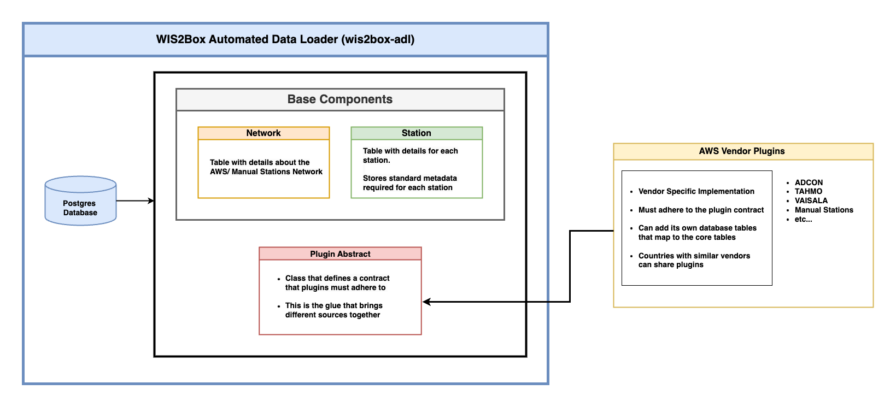

# WIS2Box Automated Data Loader

Wagtail based tool for automating periodic Observation data ingestion into WIS2Box node, from Automatic and or Manual
Weather Stations.

## 📚 Background

[WIS2 in a box](https://github.com/wmo-im/wis2box) (wis2box) is a Free and Open Source (FOSS) Reference Implementation
of a WMO WIS2 Node. The project provides a plug and play toolset to ingest, process, and publish weather/climate/water
data using standards-based approaches in alignment with the WIS2 principles. WIS2 in a box enables World Meteorological
Organization (WMO) members to publish and download data through the WIS2 network.

One of the critical steps in the WIS2 data flow is the ingestion of realtime data from observation stations (either
Manual or Automatic Weather Stations) into a WIS2 node. Setting up wis2box is one thing, but ensuring that the data from
stations is periodically ingested into the node in a timely way is another. Countries can develop their own tools and
scripts to automate this process, but this can be time-consuming and costly especially for developing countries that
have a 'cocktail' of different AWS vendors.

One of the challenges confronting NMHSs in Africa in observation data management is the disparities between the
different station types provided by different donors. This has given rise to barriers in using the data collected by
Automated Weather Stations in a harmonized way.

These disparities include major differences in the way the data from various AWS vendors are formatted and stored, which
result in poorly coordinated, fragmented, and unharmonized datasets coming from different AWS networks.

Given the broad category of AWS vendors and types that share similar purpose of collecting weather observation data,
with different storage structure, having a monolithic application would be too large and complex to accommodate all the
possible AWS vendor types in Africa NMHSs.

One solution would be to create a core application that only knows about the high-level information of the AWS network,
and then develop small units (plugins) to handle the complexities of each AWS vendor type.

This project is an implementation of such a solution.

## Introduction

WIS2Box Automated Data Loader (ADL) is a plugin based system that defines an architecture for implementing wis2box data
loaders for different AWS vendors.

The core application, which is under this repository, defines a form of contract that vendor specific plugins can extend
and provides an abstraction layer for integration of the plugins.

At a high level, this core application is made up of the following components:

- **Network component**– Table and logic with details about the AWS/Manual Stations Network. A network is a
  representation of
  a given AWS vendor type and its stations, or a collection of manual stations. When creating a network, an installed
  plugin must be associated with it to make it useful.

- **Station component** – Table and logic with details for each station, linking to different networks, including
  defining the data parameters to be used when preparing data for ingestion into WIS2Box, and a way to load stations for
  a network, from official sources like [OSCAR Surface](https://oscar.wmo.int/surface)

- **Database** – Postgres database where the system persists its data

- **Plugin Abstract** – Class that defines a contract that plugins must adhere to. This is the glue that brings diverse
  types
  of AWS vendors and sources together.

- **Background tasks** for uploading data into WIS2Box node – Each network is associated with a plugin. Since a plugin
  is standard and defines known methods of exposing its data, background tasks are created for each network that enable
  continuous checking on availability of new data and consequently the ingestion of it into a wis2box node.

On the other hand, a plugin will have the following components and features:

- **Vendor/Source specific implementation** – Depending on the vendor type, the plugin will implement the specific
  features and logic it needs to be able to communicate with its storage on a periodic basis and determine if there is
  new data to be ingested.

- **Must adhere to the plugin contract** – For the plugin to be useful and accepted by the core application, it must
  implement the plugin features as defined by the core application plugin contract.

- **Linking**- A plugin should provide a user interface for connecting its stations and data parameters to the stations
  and data parameters defined in the core application. At the implementation level, a plugin can add its own tables to
  the core application database if it requires to store information needed to link its stations with the stations
  defined in the core application.

### Objectives

- To provide a standard way of ingesting data from different AWS vendors into a WIS2Box node.
- To provide a plugin architecture that allows for the development of plugins for different AWS vendors.
- To take advantage of the Wagtail CMS Admin interface to provide a user-friendly interface that facilitates easy setup
  and management of the data loaders for different AWS vendors.
- With minimal training, users at the NMHSs should be able to set up and configure an AWS vendor plugin for their
  observation data network and start ingesting data into WIS2Box node
- Provide a repository of plugins for different AWS vendors that can be shared and reused by NMHSs in Africa.

