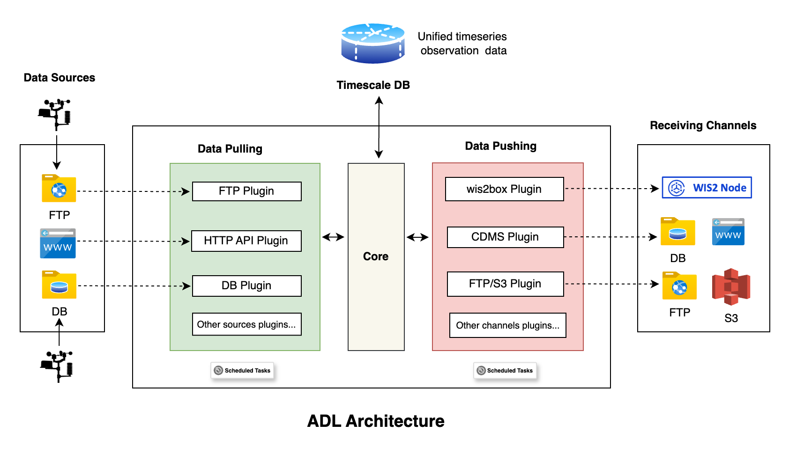

# ⚙ Automated Data Loader

Automate periodic observation data collection from different Automatic Weather Station (AWS) networks, and pushing to
different receiving systems.

## NMHSs using ADL

| No. | Country                                             | AWS/Plugins                                                                                                                                                                                                              | Push Channels                                               | Status        |
|-----|-----------------------------------------------------|--------------------------------------------------------------------------------------------------------------------------------------------------------------------------------------------------------------------------|-------------------------------------------------------------|---------------|
| 1   | 🇹🇩 [Chad](https://www.meteotchad.org)             | [ADL ADCON DB Plugin](https://github.com/wmo-raf/adl-adcon-db-plugin)                                                                                                                                                    | [Chad Wis2box](https://wis2.meteotchad.org/)                | ✅ Operational |
| 2   | 🇸🇸 [South Sudan](http://meteosouthsudan.com.ss)   | [ADL FTP Plugin](https://github.com/wmo-raf/adl-ftp-plugin), using inbuilt [Siap + Micros Decoder](https://github.com/wmo-raf/adl-ftp-plugin/blob/main/plugins/adl_ftp_plugin/src/adl_ftp_plugin/decoders/siapmicros.py) | [South Sudan Wis2box](https://wis2.meteosouthsudan.com.ss/) | ✅ Operational |
| 3   | 🇧🇫 [Burkina Faso](https://meteosouthsudan.com.ss) | [ADL FTP Plugin](https://github.com/wmo-raf/adl-ftp-plugin) with custom ADCON Decoder [ADL FTP BF Adcon Decoder](https://github.com/anam-bf/adl-ftp-adcon-bf-plugin)                                                     | [Burkina Faso Wis2box](https://wis2.meteoburkina.bf/)       | ✅ Operational |
| 4   | 🇸🇨 [Seychelles](https://www.meteo.sc)             | [ADL WeatherLink Plugin](https://github.com/wmo-raf/adl-weatherlink-v2-plugin)                                                                                                                                           | [Seychelles Wis2box](https://wis2.meteo.sc)                 | ⏳In Progress  |
| 5   | 🇬🇭 [Ghana](https://www.meteo.gov.gh)              | [ADL ADCON DB Plugin](https://github.com/wmo-raf/adl-adcon-db-plugin)                                                                                                                                                    | [Ghana Wis2box](https://wis2.meteo.gov.gh)                  | ⏳In Progress  |
| 6   | 🇲🇼 [Malawi](https://www.metmalawi.gov.mw)         | [ADL FTP Plugin](https://github.com/wmo-raf/adl-ftp-plugin), using inbuilt [Campbell TOA5 Decoder](https://github.com/wmo-raf/adl-ftp-plugin/blob/main/plugins/adl_ftp_plugin/src/adl_ftp_plugin/decoders/toa5.py)       | [Malawi Wis2box](https://wis2.metmalawi.gov.mw)             | ⏳In Progress  |
| 7   | 🇹🇬 [Togo](https://www.anamet-togo.com)            | [ADL Pulsonic Plugin](https://github.com/wmo-raf/adl-pulsoweb-plugin)                                                                                                                                                    | [Togo Wis2box](https://wis2.anamet-togo.com)                | ⏳In Progress  |
| 8   | 🇳🇪 [Niger](https://www.niger-meteo.ne)            | [ADL Pulsonic Plugin](https://github.com/wmo-raf/adl-pulsoweb-plugin)                                                                                                                                                    | Niger Wis2box                                               | ⏳In Progress  |
| 9   | 🇧🇯 [Benin](https://www.meteobenin.bj)             | [ADL Pulsonic Plugin](https://github.com/wmo-raf/adl-pulsoweb-plugin)                                                                                                                                                    | Benin Wis2box                                               | ⏳In Progress  |
| 10  | 🇳🇬 [Nigeria](https://www.nimet.gov.ng)            | TAHMO Plugin                                                                                                                                                                                                             | Nimet Wis2box                                               | ⏳In Progress  |
| 11  | 🇬🇳 [Guinea](https://anmeteo.gov.gn)               | Siap + Micros, ADCON                                                                                                                                                                                                     | Guinea wis2box                                              | ⏳In Progress  |
| 12  | 🇪🇹 [Ethiopia](https://www.ethiomet.gov.et)        | [ADL ADCON DB Plugin](https://github.com/wmo-raf/adl-adcon-db-plugin)                                                                                                                                                    | Ethiomet wis2box                                            | ⏳In Progress  |
| 13  | 🇸🇳 [Senegal](https://anacim.sn)                   | ADCON, [ADL Pulsonic Plugin](https://github.com/wmo-raf/adl-pulsoweb-plugin)                                                                                                                                             | Anacim wis2box                                              | ⏳In Progress  |

## Features

- **Data Ingestion**: Collects data from various AWS networks and manual stations, based on installed plugins.
- **Data Dispatch**: Pushes collected data to different receiving systems, based on installed plugins.
- **Plugin Architecture**: Extensible architecture allowing for custom plugins to be developed for specific AWS vendors
  or data sources.

## System Architecture

The Automated Data Loader (ADL) is a plugin based system that defines an architecture for implementing data loaders from
different observation data sources, such as Automatic Weather Stations (AWS) networks and manual stations, and pushing
the collected data to different receiving systems like wis2box, Climate Data Management Systems (CDMSs), FTP etc.

## Guide

You can access the user and developer guide at [https://adl-tool.readthedocs.io](https://adl-tool.readthedocs.io).