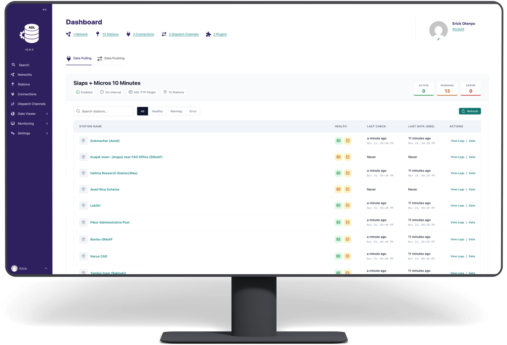
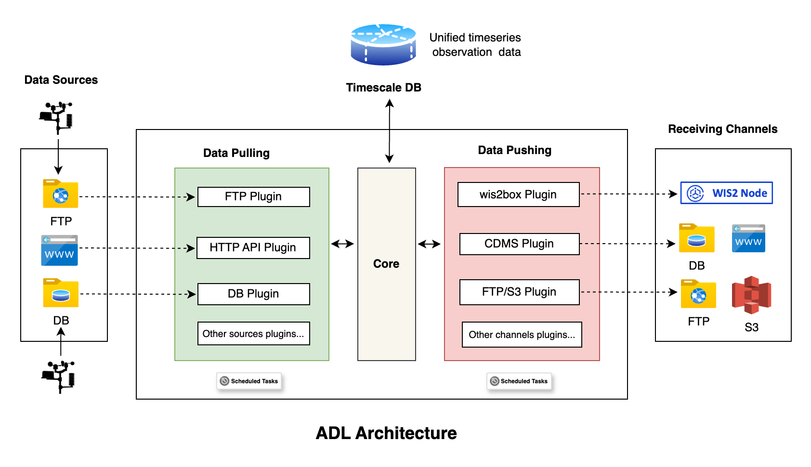

# ⚙ Automated Data Loader

Automate periodic observation data collection from different Automatic Weather Station (AWS) networks, and pushing to
different receiving systems.

## NMHSs using ADL

| No. | Country                                           | AWS / Plugins                                                             | Push Channels                                               | Status        |
|-----|---------------------------------------------------|---------------------------------------------------------------------------|-------------------------------------------------------------|---------------|
| 1   | 🇹🇩 [Chad](https://www.meteotchad.org)           | ADL ADCON DB Plugin                                                       | [Chad Wis2box](https://wis2.meteotchad.org/)                | ✅ Operational |
| 2   | 🇸🇸 [South Sudan](http://meteosouthsudan.com.ss) | ADL FTP Plugin (Siap + Micros Decoder)                                    | [South Sudan Wis2box](https://wis2.meteosouthsudan.com.ss/) | ✅ Operational |
| 3   | 🇧🇫 [Burkina Faso](https://www.meteoburkina.bf)  | ADL FTP Plugin (Custom ADCON Decoder – *FTP BF Adcon Decoder*)            | [Burkina Faso Wis2box](https://wis2.meteoburkina.bf/)       | ✅ Operational |
| 4   | 🇸🇨 [Seychelles](https://www.meteo.sc)           | ADL WeatherLink Plugin                                                    | [Seychelles Wis2box](https://wis2.meteo.sc)                 | ✅ Operational |
| 5   | 🇬🇭 [Ghana](https://www.meteo.gov.gh)            | ADL ADCON DB Plugin                                                       | [Ghana Wis2box](https://wis2.meteo.gov.gh)                  | ✅ Operational |
| 6   | 🇲🇼 [Malawi](https://www.metmalawi.gov.mw)       | ADL FTP Plugin (Campbell TOA5 Decoder)                                    | [Malawi Wis2box](https://wis2.metmalawi.gov.mw)             | ✅ Operational |
| 7   | 🇲🇱 [Mali](https://malimeteo.ml)                 | ADL PulsoWeb Plugin                                                       | [Mali Wis2box](http://wis2.malimeteo.ml)                    | ✅ Operational |
| 8   | 🇹🇬 [Togo](https://www.anamet-togo.com)          | ADL PulsoWeb Plugin                                                       | [Togo Wis2box](https://wis2.anamet-togo.com)                | ✅ Operational |
| 9   | 🇳🇬 [Nigeria](https://www.nimet.gov.ng)          | ADL TAHMO Plugin                                                          | [Nimet Wis2box](https://wis2.nimet.gov.ng)                  | ✅ Operational |
| 10  | 🇿🇼 [Zimbabwe](https://www.weatherzw.org.zw)     | ADL FTP Plugin (Campbell TOA5 Decoder)                                    | [MSD Wis2box](https://wis2.weatherzw.org.zw)                | ✅ Operational |
| 11  | 🇧🇮 [Burundi](https://www.igebu.bi)              | ADL ADCON Plugin, ADL EarthNetworks Plugin                                | [Igebu Wis2box](https://wis2.igebu.bi)                      | ✅ Operational |
| 12  | 🇰🇪 [Kenya](https://meteo.go.ke)                 | ADL FTP Plugin (Sutron, Microstep, ADCON, Vaisala, Pulsonic, Seba, TAHMO) | [Kenya Wis2box](http://wis.meteo.go.ke)                     | ✅ Operational |
| 13  | 🇧🇯 [Benin](https://www.meteobenin.bj)           | ADL PulsoWeb Plugin                                                       | [Benin Wis2box](http://wis2.meteobenin.bj)                  | ✅ Operational |
| 14  | 🇲🇿 [Mozambique](https://inam.gov.mz)            | ADL FTP Plugin ( Campbell + NESA)                                         | [INAM wis2box](https://wis2.inam.gov.mz)                    | ✅ Operational |
| 15  | 🇲🇿 [Congo](https://dirmet.cg/)                  | ADL PusloWeb Plugin                                                       | [DIRMET wis2box](https://wis.dirmet.cg/)                    | ✅ Operational |
| 16  | 🇨🇮 [Côte d’Ivoire](https://sodexam.com)         | ADL PulsoWeb Plugin, ADL FTP Plugin (Campbell Scientific)                 | [Côte d’Ivoire](https://wis2.sodexam.ci)                    | ✅ Operational |
| 17  | 🇳🇪 [Niger](https://www.niger-meteo.ne)          | ADL PulsoWeb Plugin                                                       | Niger Wis2box                                               | ⏳ In Progress |
| 18  | 🇬🇳 [Guinea](https://anmeteo.gov.gn)             | Siap + Micros, ADCON                                                      | Guinea Wis2box                                              | ⏳ In Progress |
| 19  | 🇪🇹 [Ethiopia](https://www.ethiomet.gov.et)      | ADL ADCON DB Plugin                                                       | Ethiomet Wis2box                                            | ⏳ In Progress |
| 20  | 🇸🇳 [Senegal](https://anacim.sn)                 | ADCON, ADL PulsoWeb Plugin                                                | Senegal Wis2box                                             | ⏳ In Progress |
| 21  | 🇸🇩 [Sudan](https://meteosudan.sd)               | ADL CIMAWebDrops Plugin                                                   | —                                                           | ⏳ In Progress |
| 22  | 🇺🇬 Uganda                                       | ADL ADCON DB Plugin                                                       | Uganda Wis2box                                              | ⏳ In Progress |
| 23  | 🇬🇲 Gambia                                       | —                                                                         | —                                                           | ⏳ In Progress |
| 24  | 🇱🇷 Liberia                                      | ADL ADCON Plugin                                                          | —                                                           | ⏳ In Progress |
| 25  | 🇿🇲 Zambia                                       | ADL FTP Plugin                                                            | -                                                           | ⏳ In Progress |
| 26  | 🇲🇷 Mauritania                                   | ADL PulsoWeb Plugin                                                       | -                                                           | ⏳ In Progress |

## List of Plugins

Below is a list of currently available plugins for the Automated Data Loader (ADL). Each plugin is designed to collect
data from specific data sources or systems.

| No. | Plugin Name              | Description                                              | Link                                                                                |
|-----|--------------------------|----------------------------------------------------------|-------------------------------------------------------------------------------------|
| 1   | ADL FTP Plugin           | Collecting data from FTP storages                        | [adl-ftp-plugin](https://github.com/wmo-raf/adl-ftp-plugin)                         |
| 2   | ADL ADCON DB Plugin      | Collecting data from ADCON Postgres database             | [adl-adcon-db-plugin](https://github.com/wmo-raf/adl-adcon-db-plugin)               |
| 3   | ADL TAHMO Plugin         | Collecting data from TAHMO API                           | [adl-tahmo-plugin](https://github.com/wmo-raf/adl-tahmo-plugin)                     |
| 4   | ADL PulsoWeb Plugin      | Collecting data from Pulsonic's Pulsoweb API             | [adl-pulsoweb-plugin](https://github.com/wmo-raf/adl-pulsoweb-plugin)               |
| 5   | ADL WeatherLink Plugin   | Collecting data from Davis Instruments's WeatherLink API | [adl-weatherlink-plugin](https://github.com/wmo-raf/adl-weatherlink-plugin)         |
| 6   | ADL CIMAWebDrops Plugin  | Collecting data from CIMA's WebDrops API                 | [adl-cimawebdrops-plugin](https://github.com/wmo-raf/adl-cimawebdrops-plugin)       |
| 7   | ADL EarthNetworks Plugin | Collecting data from EarthNetworks                       | [adl-earthnetworks-plugin](    https://github.com/wmo-raf/adl-earthnetworks-plugin) |

### Country Specific FTP Decoders

| No. | Plugin Name                | Description                                        | Link                                                                                       |
|:----|----------------------------|----------------------------------------------------|--------------------------------------------------------------------------------------------|
| 1   | ADL ADCON BF Decoder       | FTP Decoder for Burkina Faso ADCON                 | [adl-ftp-adcon-bf-plugin](https://github.com/anam-bf/adl-ftp-adcon-bf-plugin)              |
| 2   | ADL Vaisala SC FTP Decoder | FTP Decoder  for the Seychelles Vaisala Avimet AWS | [adl-vaisala-sc-ftp-decoder](https://github.com/seychelles-met/adl-vaisala-sc-ftp-decoder) |
| 3   | ADL ADCON SOM Decoder      | FTP Decoder for Somalia ADCON                      | [adl-ftp-adcon-som-plugin](https://github.com/wmo-raf/adl-ftp-adcon-som-plugin)            |
| 4   | ADL NESA MZ Decoder        | FTP Decoder for Mozambique NESA                    | [adl-mz-nesa-decoder](https://github.com/inam-mz/adl-mz-nesa-decoder)                      |

## Features

- **Data Ingestion**: Collects data from various AWS networks and manual stations, based on installed plugins.
- **Data Dispatch**: Pushes collected data to different receiving systems, based on installed plugins.
- **Plugin Architecture**: Extensible architecture allowing for custom plugins to be developed for specific AWS vendors
  or data sources.

## System Architecture

The Automated Data Loader (ADL) is a plugin based system that defines an architecture for implementing data loaders from
different observation data sources, such as Automatic Weather Stations (AWS) networks and manual stations, and pushing
the collected data to different receiving systems like wis2box, Climate Data Management Systems (CDMSs), FTP etc.

## Documentation

You can access the user and developer guide at [https://adl-tool.readthedocs.io](https://adl-tool.readthedocs.io)

## Legal

See [LEGAL.md](LEGAL.md)
