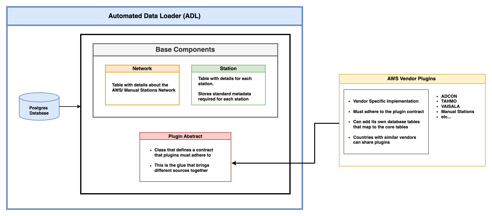

# ⚙ Automated Data Loader

Automate periodic observation data collection from different Automatic Weather Station (AWS) networks, and pushing to
different receiving systems.


## NMHSs using ADL

| No. | Country                                             | AWS/Plugins                                                                                                                                                                                                              | Push Channels                                               | Status        |
|-----|-----------------------------------------------------|--------------------------------------------------------------------------------------------------------------------------------------------------------------------------------------------------------------------------|-------------------------------------------------------------|---------------|
| 1   | 🇹🇩 [Chad](https://www.meteotchad.org)             | [ADL ADCON DB Plugin](https://github.com/wmo-raf/adl-adcon-db-plugin)                                                                                                                                                    | [Chad Wis2box](https://wis2.meteotchad.org/)                | ✅ Operational |
| 2   | 🇸🇸 [South Sudan](http://meteosouthsudan.com.ss)   | [ADL FTP Plugin](https://github.com/wmo-raf/adl-ftp-plugin), using inbuilt [Siap + Micros Decoder](https://github.com/wmo-raf/adl-ftp-plugin/blob/main/plugins/adl_ftp_plugin/src/adl_ftp_plugin/decoders/siapmicros.py) | [South Sudan Wis2box](https://wis2.meteosouthsudan.com.ss/) | ✅ Operational |
| 3   | 🇧🇫 [Burkina Faso](https://meteosouthsudan.com.ss) | [ADL FTP Plugin](https://github.com/wmo-raf/adl-ftp-plugin) with custom ADCON Decoder [ADL FTP BF Adcon Decoder](https://github.com/anam-bf/adl-ftp-adcon-bf-plugin)                                                     | [Burkina Faso Wis2box](https://wis2.meteoburkina.bf/)       | ✅ Operational |
| 4   | 🇸🇨 [Seychelles](https://www.meteo.sc)             | [ADL WeatherLink Plugin](https://github.com/wmo-raf/adl-weatherlink-v2-plugin)                                                                                                                                           | [Seychelles Wis2box](https://wis2.meteo.sc)                 | ⏳In Progress  |
| 5   | 🇬🇭 [Ghana](https://www.meteo.gov.gh)              | [ADL ADCON DB Plugin](https://github.com/wmo-raf/adl-adcon-db-plugin)                                                                                                                                                    | [Ghana Wis2box](https://wis2.meteo.gov.gh)                  | ⏳In Progress  |
| 6   | 🇲🇼 [Malawi](https://www.metmalawi.gov.mw)         | [ADL FTP Plugin](https://github.com/wmo-raf/adl-ftp-plugin), using inbuilt [Campbell TOA5 Decoder](https://github.com/wmo-raf/adl-ftp-plugin/blob/main/plugins/adl_ftp_plugin/src/adl_ftp_plugin/decoders/toa5.py)       | [Malawi Wis2box](https://wis2.metmalawi.gov.mw)             | ⏳In Progress  |
| 7   | 🇹🇬 [Togo](https://www.anamet-togo.com)            | [ADL Pulsonic Plugin](https://github.com/wmo-raf/adl-pulsoweb-plugin)                                                                                                                                                    | [Togo Wis2box](https://wis2.anamet-togo.com)                | ⏳In Progress  |
| 8   | 🇳🇪 [Niger](https://www.niger-meteo.ne)            | [ADL Pulsonic Plugin](https://github.com/wmo-raf/adl-pulsoweb-plugin)                                                                                                                                                    | Niger Wis2box                                               | ⏳In Progress  |
| 9   | 🇧🇯 [Benin](https://www.meteobenin.bj)             | [ADL Pulsonic Plugin](https://github.com/wmo-raf/adl-pulsoweb-plugin)                                                                                                                                                    | Benin Wis2box                                               | ⏳In Progress  |
| 10  | 🇳🇬 [Nigeria](https://www.nimet.gov.ng)            | TAHMO Plugin                                                                                                                                                                                                             | Nimet Wis2box                                               | ⏳In Progress  |
| 11  | 🇬🇳 [Guinea](https://anmeteo.gov.gn)               | Siap + Micros, ADCON                                                                                                                                                                                                     | Guinea wis2box                                              | ⏳In Progress  |
| 12  | 🇪🇹 [Ethiopia](https://www.ethiomet.gov.et)        | [ADL ADCON DB Plugin](https://github.com/wmo-raf/adl-adcon-db-plugin)                                                                                                                                                    | Ethiomet wis2box                                            | ⏳In Progress  |
| 13  | 🇸🇳 [Senegal](https://anacim.sn)                   | ADCON, [ADL Pulsonic Plugin](https://github.com/wmo-raf/adl-pulsoweb-plugin)                                                                                                                                             | Anacim wis2box                                              | ⏳In Progress  |

## 📚 Background

One of the challenges confronting NMHSs in Africa in observation data management is the disparities between the
different station types managed by the institutions or provided through projects. This has given rise to barriers in
using the data collected by Automated Weather Stations in a harmonized way.

These disparities include major differences in the way the data from various AWS vendors are formatted and stored, which
result in poorly coordinated, fragmented, and un-harmonized datasets coming from different AWS networks.

Given the broad category of AWS vendors and types that share similar purpose of collecting weather observation data,
with different storage structure, having a monolithic application would be too large and complex to accommodate all the
possible AWS vendor types in Africa NMHSs.

A solution for unifying this data collection would be to have a core application that only knows about the high-level
information of the AWS network, and then develop small units (plugins) on demand, to handle the complexities of each AWS
vendor type. Similar case for pushing data to different receiving systems. For each receiving channel (could be an FTP,
Database, API, Webhook, S3 Storage etc), a plugin can be developed to handle the complexities of periodically pushing
data to these systems.

This project is an implementation of such a solution.

The initial idea for this project was to create a tool that would automate the collection of data from different AWS and
ingest into a [WIS2Box node](https://github.com/wmo-im/wis2box). However, this has been expanded to include the ability
to develop plugins to send to other receiving storages and systems

[WIS2 in a box](https://github.com/wmo-im/wis2box) (wis2box) is a Free and Open Source (FOSS) Reference Implementation
of a WMO WIS2 Node. The project provides a plug and play toolset to ingest, process, and publish weather/climate/water
data using standards-based approaches in alignment with the WIS2 principles. WIS2 in a box enables World Meteorological
Organization (WMO) members to publish and download data through the WIS2 network.

One of the critical steps in the WIS2 data flow is the ingestion of realtime data from observation stations (either
Manual or Automatic Weather Stations) into a WIS2 node. Setting up wis2box is one thing, ensuring that the data from
stations is periodically ingested into the node in a timely way is another. Countries can develop their own tools and
scripts to automate this process, but this can be time-consuming and costly especially for developing countries that
have a 'cocktail' of different AWS vendors.


## 📜 Introduction

The Automated Data Loader (ADL) is a plugin based system that defines an architecture for implementing data loaders for
different AWS vendors.

The core application, which is under this repository, defines a form of contract that vendor specific plugins can extend
and provides an abstraction layer for integration of the plugins.

At a high level, this core application is made up of the following components:

- **Network component**– Table and logic with details about the AWS/Manual Stations Network. A network is a
  representation of a given AWS vendor type and its stations, or a collection of manual stations. When creating a
  network, an installed plugin must be associated with it to make it useful.

- **Station component** – Table and logic with details for each station, linking to different networks, including
  defining the data parameters to be used when preparing data for ingestion into WIS2Box, and a way to load stations for
  a network, from official sources like [OSCAR Surface](https://oscar.wmo.int/surface)

- **Database** – Postgres database where the system persists its data

- **Plugin Abstract** – Class that defines a contract that plugins must adhere to. This is the glue that brings diverse
  types
  of AWS vendors and sources together.

- **Background tasks** for uploading data into WIS2Box node – Each network is associated with a plugin. Since a plugin
  is standard and defines known methods of exposing its data, background tasks are created for each network that enable
  continuous checking on availability of new data and consequently the ingestion of it into a wis2box node.

On the other hand, a plugin will have the following components and features:

- **Vendor/Source specific implementation** – Depending on the vendor type, the plugin will implement the specific
  features and logic it needs to be able to communicate with its storage on a periodic basis and determine if there is
  new data to be ingested.

- **Must adhere to the plugin contract** – For the plugin to be useful and accepted by the core application, it must
  implement the plugin features as defined by the core application plugin contract.

- **Linking**- A plugin should provide a user interface for connecting its stations and data parameters to the stations
  and data parameters defined in the core application. At the implementation level, a plugin can add its own tables to
  the core application database if it requires to store information needed to link its stations with the stations
  defined in the core application.



### 📋 Objectives

- To provide a tool for automating collection of data from different AWS vendors into a central unified database.
- To provide a plugin architecture that allows for the development of plugins for different AWS vendors.
- To take advantage of the Wagtail CMS Admin interface to provide a user-friendly interface that facilitates easy setup
  and management of the data loaders for different AWS vendors.
- With minimal training, users at the NMHSs should be able to set up and configure an AWS vendor plugin for their
  observation data network and start to automatically ingesting data into different platforms, like wis2box or Climate
  Database Management Systems (CDMS).
- Provide a repository of plugins for different AWS vendors that can be shared and reused by NMHSs across Africa.

### ⚗️ Technology Stack

- The core application is built using the [Django](https://www.djangoproject.com/) framework
  and [Wagtail](https://wagtail.org/). Wagtail is used mainly for the Admin interface since it allows for easy
  customization and extension
- [PostgreSQL](https://www.postgresql.org/) with [Timescale db](https://www.timescale.com/) extension is used as the
  database for the system.
- [Celery](https://docs.celeryq.dev/en/stable/index.html) is used for background tasks.
- [Redis](https://redis.io/) is used as the message broker for Celery.
- The system is containerized using [Docker](https://www.docker.com/)
  and [docker compose](https://docs.docker.com/compose/).
- Plugins are developed as Django/Wagtail apps and integrated into wagtail
  using [Wagtail hooks](https://docs.wagtail.org/en/stable/reference/hooks.html).
- [Nginx](https://nginx.org) is used the static and reverse proxy server for the system.
- Bash scripts are used for installing the plugins and their dependencies at runtime.

## 🧩 Plugins List

The following are the plugins that have been developed and are available for integration with the WIS2Box ADL core:

- [Adcon Telemetry Database Plugin](https://github.com/wmo-raf/adl-adcon-db-plugin)
- [Davis Instruments Weatherlink Plugin](https://github.com/wmo-raf/wis2box-adl-weatherlink-v2-plugin)
- [Pulsonic PulsoWeb Plugin](https://github.com/wmo-raf/adl-pulsoweb-plugin)
- [Generic FTP Plugin](https://github.com/wmo-raf/adl-ftp-plugin)

## 🏁 Getting Started

### Pre-requisites

Before following the steps below, make sure you have the following set up:

- Docker Engine & Docker Compose Plugin : Ensure that Docker Engine is installed and running on the machine where you
  plan to execute the docker compose command https://docs.docker.com/engine/install/. Docker Engine is the runtime
  environment for containers.

### Installation

#### 1. Clone the repository

```sh
git clone https://github.com/wmo-raf/adl.git
cd adl
```

#### 2. Setup Environment Variables

Copy the `.env.sample` file to `.env` and update the environment variables as needed.

```sh
cp .env.sample .env
```

Edit and replace variables appropriately using your text editor. Here is an example using `nano` text editor.

```sh
nano .env
```

See [environmental variables' section](#environmental-variables) below for more details on the required variables

#### 3. Create Wagtail static and media directories on the host machine and set correct permissions

Ensure you are using the correct paths as set in the `.env` file for the `ADL_STATIC_VOLUME`
and `ADL_MEDIA_VOLUME` variables.

```sh
mkdir -p ./docker/static
```

```sh
mkdir -p ./docker/media
```

##### Update the permissions for the directories

```sh
sudo chown <UID>:<GID> ./docker/static
```

```sh
sudo chown <UID>:<GID> ./docker/media
```

Replace `<UID>` and `<GID>` with the values set in the `.env` file for the `UID` and `GID` variables

`NOTE:` The database volume uses UID `1000` and GID `1000` by default. Set the correct permissions for the volume as
below:

```sh
sudo chown 1000:1000 ./docker/db_data
```

#### 4. Build and Run the Docker Containers

```sh
docker compose build
```

```sh
docker compose up
```

To run the containers in the background, use the `-d` flag

```sh
docker compose up -d
```

#### 5. Create Superuser

```sh
docker compose exec adl /bin/bash

adl createsuperuser
```

`adl` is a shortcut python script that is available in the container that calls Django's `manage.py`

### Environmental Variables

The following environmental variables are required to be set in the `.env` file:

| Variable Name               | Description                                                                                                                                                                                                                                                                                                               | Required | Default Value    | Details                                                                                                            |
|-----------------------------|---------------------------------------------------------------------------------------------------------------------------------------------------------------------------------------------------------------------------------------------------------------------------------------------------------------------------|----------|------------------|--------------------------------------------------------------------------------------------------------------------|
| SECRET_KEY                  | A secret key for a particular Django installation. This is used to provide cryptographic signing, and should be set to a unique, unpredictable value. Django will refuse to start if SECRET_KEY is not set.You can use this online tool [https://djecrety.ir](https://djecrety.ir/) to generate the key and paste         | YES      |                  |                                                                                                                    |
| ALLOWED_HOSTS               | A list of strings representing the host/domain names that this Django site can serve. This is a security measure to prevent HTTP Host header attacks, which are possible even under many seemingly-safe web server.                                                                                                       | YES      |                  | [Django Allowed Hosts](https://docs.djangoproject.com/en/4.2/ref/settings/#std-setting-ALLOWED_HOSTS)              |
| CSRF_TRUSTED_ORIGINS        | A list of trusted origins for unsafe requests                                                                                                                                                                                                                                                                             | NO       |                  | [Django CSRF Trusted Origins](https://docs.djangoproject.com/en/5.1/ref/settings/#csrf-trusted-origins)            |
| ADL_DEBUG                   | A boolean that turns on/off debug mode. Never deploy a site into production with DEBUG turned on                                                                                                                                                                                                                          | NO       | False            |                                                                                                                    |
| WAGTAIL_SITE_NAME           | The human-readable name of your Wagtail installation which welcomes users upon login to the Wagtail admin.                                                                                                                                                                                                                | NO       | WIS2BOX ADL      |                                                                                                                    |
| LANGUAGE_CODE               | The language code for the CMS. Available codes are `en` for English. Default is en if not set. Available codes in alphabetical order: `am` for Amharic,`ar` for Arabic, `en` for English, `es` for Spanish, `fr` for French, `sw` for Swahili. The translation are done with automated tools and may not be 100% accurate | NO       | en               |                                                                                                                    |
| ADL_LOG_LEVEL               | The severity of the messages that the adl service logger will handle. Allowed values are: `DEBUG`, `INFO`, `WARNING`, `ERROR` and `CRITICAL`                                                                                                                                                                              | NO       | WARN             |                                                                                                                    |
| ADL_GUNICORN_NUM_OF_WORKERS | Number of Gunicorn workers                                                                                                                                                                                                                                                                                                | YES      | 4                |                                                                                                                    |
| ADL_GUNICORN_TIMEOUT        | Gunicorn timeout in seconds                                                                                                                                                                                                                                                                                               | YES      | 300              |                                                                                                                    |
| ADL_CELERY_BEAT_DEBUG_LEVEL | The severity of the messages that the adl_celery_beat service logger will handle. Allowed values are: `DEBUG`, `INFO`, `WARNING`, `ERROR` and `CRITICAL`                                                                                                                                                                  | NO       | INFO             |                                                                                                                    |
| ADL_CELERY_WORKER_LOG_LEVEL | The severity of the messages that the adl_celery_worker service logger will handle. Allowed values are: `DEBUG`, `INFO`, `WARNING`, `ERROR` and `CRITICAL`                                                                                                                                                                | NO       | INFO             |                                                                                                                    |
| ADL_DB_USER                 | ADL Database user                                                                                                                                                                                                                                                                                                         | YES      |                  |                                                                                                                    |
| ADL_DB_PASSWORD             | ADL Database password                                                                                                                                                                                                                                                                                                     | YES      |                  |                                                                                                                    |
| ADL_DB_NAME                 | ADL Database name                                                                                                                                                                                                                                                                                                         | YES      |                  |                                                                                                                    |
| ADL_DB_VOLUME               | Mounted docker volume path for persisting database data                                                                                                                                                                                                                                                                   | YES      | ./docker/db_data |                                                                                                                    |
| ADL_STATIC_VOLUME           | Mounted docker volume path for persisting django static files                                                                                                                                                                                                                                                             | YES      | ./docker/static  |                                                                                                                    |
| ADL_MEDIA_VOLUME            | Mounted docker volume path for persisting django media files                                                                                                                                                                                                                                                              | YES      | ./docker/media   |                                                                                                                    |
| ADL_BACKUP_VOLUME           | Mounted docker volume path for persisting db backups and media files                                                                                                                                                                                                                                                      | YES      | ./docker/backup  |                                                                                                                    |
| ADL_WEB_PROXY_PORT          | Port Nginx will be available on the host                                                                                                                                                                                                                                                                                  | YES      | 80               |                                                                                                                    |
| UID                         | The id of the user to run adl docker services                                                                                                                                                                                                                                                                             |          |                  |                                                                                                                    |
| GID                         | The id of the group to run adl docker services                                                                                                                                                                                                                                                                            |          |                  |                                                                                                                    |
| ADL_PLUGIN_GIT_REPOS        | A comma separated list of github repos, where adl plugins to install are located                                                                                                                                                                                                                                          | NO       |                  | If no repo is added, no plugin is installed. A plugin must follow a given structure as described in sections below |

`Note`: On linux, you can type `id` in the terminal to get the `UID` and `GID` of the current user.

### Adding plugins

To make this tool useful, you need to add plugins that will be used to load data from different AWS vendors.

Currently, you can only install plugins that are hosted on a publicly accessible git repository.

To add a plugin, you need to set the `ADL_PLUGIN_GIT_REPOS` variable in the `.env` file to a comma-separated
list of git repositories where the plugins are located.

For example, to add the Adcon Telemetry Plugin, you will need the link to its Github repository and add it to
the `ADL_PLUGIN_GIT_REPOS` variable in the `.env` file.

```
ADL_PLUGIN_GIT_REPOS=https://github.com/wmo-raf/adl-adcon-plugin.git
```

To add multiple plugins, separate the links with a comma.

For example to add both the Adcon Telemetry Plugin and the Davis Instruments Weatherlink Plugin, you will set the
variable as follows:

```
ADL_PLUGIN_GIT_REPOS=https://github.com/wmo-raf/adl-adcon-plugin.git,https://github.com/wmo-raf/adl-weatherlink-v2-plugin.git
```

Then restart the docker containers

```sh
docker compose stop
docker compose up -d --force-recreate
```

## User Guide

### 1. Access the Admin Interface

The admin interface can be accessed at `http://<ip_or_domain>:<ADL_WEB_PROXY_PORT>`.

Replace `<ip_or_domain>` with the IP address or domain name of the machine where the application is running and
`<ADL_WEB_PROXY_PORT>` with the port number as set in the `.env` file.

For example, if the IP address of the machine is set as `127.0.0.1` and the port as `8000`, you can access the admin
through `http://127.0.0.1:8000`. If the port is set as `80`, you can access the admin directly
through `http://127.0.0.1`.

Below is how the admin interface will look when first accessed.


### 2. Create a Network

A network is a representation of a given AWS vendor type and its stations, or a collection of manual stations.

You can add a network by clicking on the `Networks` link on the left sidebar and then clicking on the `Add Network`


Fill in the details for the network and click on the `Save` button.


A network must be associated with a plugin to make it useful. You can select the plugin to associate with the network by
selecting from the `Plugin` dropdown. This will be a list of plugins that have been installed.

#### The following fields control how the plugin will be processing data:

- **Plugin Auto Processing Enabled**: This is a boolean field that determines if the plugin is active and should be
  ingesting data

- **Plugin Auto Processing Interval**: This is the interval in minutes that the plugin should check for new data to
  ingest

- **Enable WIS2Box Hourly Aggregation**: This is a boolean field that determines if the plugin should aggregate data
  that
  is ingested into a wis2box node on an hourly basis. This is in-support of the `GBON` requirement that requires data to
  be transmitted to the WIS2.0 system in an hourly intervals. If this is enabled, the plugin will aggregate data pushed
  into wis2box node into an hourly interval depending on the selected method.

- **WIS2Box Hourly Aggregation Method**: This is the method that will be used to aggregate data into an hourly
  interval. Currently, the method `Latest in the Hour` is implemented. This method will take the latest data point in
  the
  hour and use it as the hourly data point. Other methods like `averaging` can be implemented in the future.

- **UnUploaded Records Check Interval in Minutes**: This is the interval in minutes that the plugin should check for
  records, that for some reason (like the wis2box node being down), were not uploaded to the WIS2Box node. This is to
  ensure that all that was collected is pushed to wis2box. This also ensures that hourly aggregation data is ingested
  into
  wis2box.

### 3. Add Stations to a Network

After creating a network, you can add stations to the network. Stations are the actual AWS stations or manual stations.

> Stations added to ADL are expected to be already added to your wis2box node, to be able to ingest data from them.


There are two ways to add stations to a network as shown in the image above:

#### Manual Entry

You can manually add stations to a network by clicking on the `Stations` link on the left sidebar
and then clicking on the `Add Station` button.

You will be required to fill in the station details, WIGOS information, and station metadata.

**Station Base Info**


**Station WIGOS Info**


**Station Metadata**


#### Importing from WMO OSCAR Surface

The quickest way to load stations is by importing from the [WMO OSCAR Surface](https://oscar.wmo.int/surface/#/)
database.

You can do so by clicking on the `Stations` link on the left sidebar and then clicking on
the `Load Stations from OSCAR Surface` button.

This will load stations from the OSCAR Surface database, and you can select the stations to add to the network.


##### Using a local CSV Copy of stations data downloaded from OSCAR Surface

If you face network issues when connecting to the WMO OSCAR Surface API, you can import a pre-downloaded CSV file of
stations data for your country. The data should be downloaded from the
official [WMO OSCAR Surface](https://oscar.wmo.int/surface) website.


This will open a form where you can upload the CSV file. The CSV file should be in the structure as downloaded from WMO
OSCAR Surface.


If the CSV file is successfully uploaded, you will be redirected to a page where you can select the stations to import.


Irrespective of the method used to load stations from OSCAR Surface database, the importing process of the loaded
stations into the system will be the same.


After clicking on the `Import Station` button, a form with the station to import will be displayed. Here you will be
required to set the `Staton ID` and assign the station to a network and select if the station is an AWS station or
manual.


Then click on the `Import` button to import the station.

### 4. Plugin Configuration

To start ingesting data from the stations, you need to configure the plugin associated with the network.

The actual configuration will depend on the plugin you have installed. Ideally, the plugin should provide a user
interface for connecting its stations and data parameters to the stations and data parameters defined in the core
application.

For plugin specific guides, refer to the plugin documentation. Above, you can file [list of the current publicly
accessible plugins](#-plugins-list).

Below we continue to describe the process of developing new plugins.

## Developing Plugins

In this guide we dive into how to create an adl plugin, discuss the plugin architecture and give you sample
plugins to get inspiration from.

### Plugin Architecture

An ADL Plugin is fundamentally a folder named after the plugin. The folder should be
a [Django/Wagtail App](https://docs.djangoproject.com/en/5.1/ref/applications/)

#### Initialize your plugin from the plugin template

The plugin template is a [cookiecutter](https://cookiecutter.readthedocs.io/en/stable/installation.html) template that
generates a plugin with the required structure and files. This ensures that the plugin follows the expected structure
and can be easily installed into the wis2box-adl core application.

To instantiate the template, execute the following commands from the directory where you want to create the plugin:

```sh
pip install cookiecutter
cookiecutter gh:wmo-raf/adl --directory plugin-boilerplate
```

For more details on using the plugin boilerplate, you can follow the [step-by-step guide](#plugin-boilerplate) on
creating a plugin using the plugin boilerplate.

#### Plugin Installation API

A wis2box-adl docker image contains the following bash scripts that are used to install plugins. They can be used
to install a plugin into an existing wis2box-adl container at runtime. `install_plugin.sh` can be used to install a
plugin from an url, a git repo or a local folder on the filesystem.

You can find these scripts in the following locations in the built images:

1. `/adl/plugins/install_plugin.sh`

On this repo, you can find the scripts in the `deploy/plugins` folder.

These scripts expect a wis2box-adl plugin to follow the conventions described below:

#### Plugin File Structure

The `install_plugin.sh` script expect your plugin to have a specific structure as follows:

```
├── plugin_name
│  ├── adl_plugin_info.json (A simple json file containing info about your plugin)
|  ├── setup.py
|  ├── build.sh (Called when installing the plugin in a Dockerfile/container)
|  ├── runtime_setup.sh (Called on first runtime startup of the plugin)
|  ├── uninstall.sh (Called when uninstalling the plugin in a container)
|  ├── src/plugin_name/src/config/settings/settings.py (Optional Django setting file)
```

The folder contains three bash files which will be automatically called by wis2box-adl's plugin scripts during
installation and uninstallation of the plugin. You can use these scripts to perform extra build steps, installation of
packages and other docker container build steps required by your plugin.

1. `build.sh`: Called on container startup if a runtime installation is occurring.
2. `runtime_setup.sh`: Called the first time a container starts up after the plugin has been installed, useful for
   running superuser commands on the container.
3. `uninstall.sh`: Called on uninstall, the database will be available and so any backwards migrations should be run
   here.

#### The plugin info file

The `adl_plugin_info.json` file is a json file, in your root plugin folder, containing metadata about your
plugin. It should have the following JSON structure:

```json
{
  "name": "TODO",
  "version": "TODO",
  "description": "TODO",
  "author": "TODO",
  "author_url": "TODO",
  "url": "TODO",
  "license": "TODO",
  "contact": "TODO"
}
```

#### Expected plugin structure when installing from a git repository

When installing a plugin from git,the repo should contain a single plugins folder, inside which there should a single
plugin folder following the structure above and has the same name as your plugin.

By default, the `plugin boilerplate` generates a repository with this structure.

For example a conforming git repo should contain something like:

```
├─ * (an outermost wrapper directory named anything is allowed but not required) 
│  ├── plugins/ 
│  │  ├── plugin_name
│  |  |  ├── adl_plugin_info.json
|  |  |  ├── setup.py
|  |  |  ├── build.sh
|  |  |  ├── runtime_setup.sh
|  |  |  ├── uninstall.sh
|  |  |  ├── src/plugin_name/src/config/settings/settings.py (Optional Django setting file)
```

#### Plugin Boilerplate

With the plugin boilerplate you can easily create a new plugin and setup a docker development environment that installs
wis2box-adl as a dependency. This can easily be installed via cookiecutter.

##### Creating a plugin

To use the plugin boilerplate you must first install
the [Cookiecutter](https://cookiecutter.readthedocs.io/en/stable/installation.html) tool (`pip install cookiecutter`).

Once you have installed Cookiecutter you can execute the following command to create a new ADL plugin from our
template. In this guide we will name our plugin “My WIS2Box ADL Plugin”, however you can choose your own plugin name
when prompted to by Cookiecutter.

> The python module depends on your chosen plugin name. If we for example go with “My WIS2Box ADL Plugin” the Django app
> name should be my_adl_plugin

```sh
cookiecutter gh:wmo-raf/adl --directory plugin-boilerplate
project_name [My WIS2Box ADL Plugin]: 
project_slug [my-adl-plugin]: 
project_module [my_adl_plugin]:
```

If you do not see any errors it means that your plugin has been created.

##### Starting the development environment

Now to start your development environment please run the following commands:

```sh
cd my-wis2box-adl-plugin
# Enable Docker buildkit
export COMPOSE_DOCKER_CLI_BUILD=1
export DOCKER_BUILDKIT=1
# Set these variables so the images are built and run with the same uid/gid as your 
# user. This prevents permission issues when mounting your local source into
# the images.
export PLUGIN_BUILD_UID=$(id -u)
export PLUGIN_BUILD_GID=$(id -g)
# You can optionally `export COMPOSE_FILE=docker-compose.dev.yml` so you don't need to 
# use the `-f docker-compose.dev.yml` flag each time.
docker compose -f docker-compose.dev.yml up -d --build
docker compose -f docker-compose.dev.yml logs -f
```