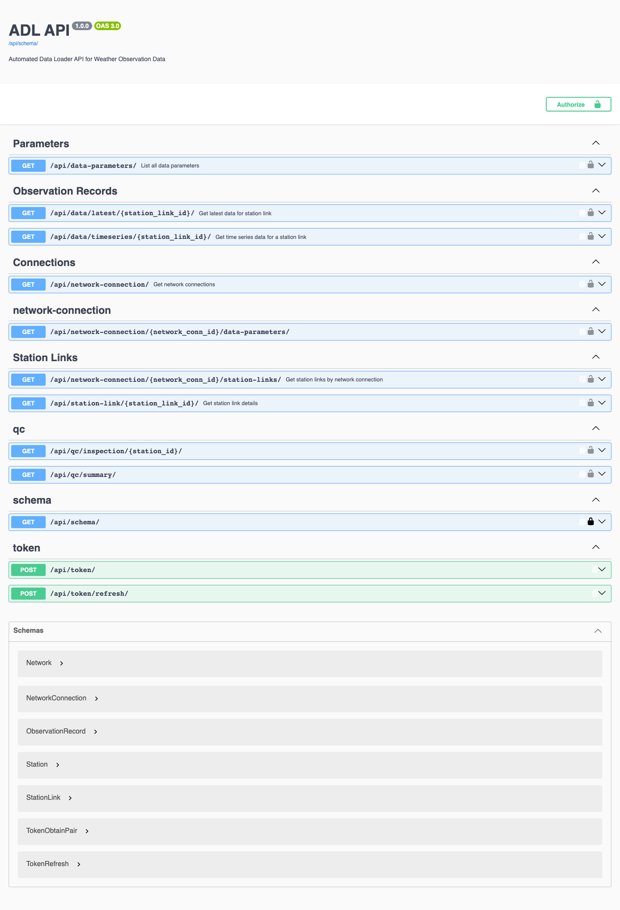

(rest-api)=

# 🔌 REST API

ADL exposes a read-only REST API for pulling stored observations and the
metadata around them into other systems: a national dashboard, a CDMS
import script, a research notebook. The data viewer in the admin is built
on the same endpoints, so anything you can see there you can fetch here.

**Base URL:** `http://<adl-host>/api/`
**Interactive docs:** `/api/docs/swagger/` (try-it-out) and
`/api/docs/redoc/` (reference), both generated from the live schema at
`/api/schema/`. Sign in to the admin first; the docs pages use your session.


<!-- screenshot: manifest entry user/api/swagger_ui -->

## Authentication

Every endpoint requires one of the following. Anonymous requests get
`401 Unauthorized`.

| Method | For | How |
|---|---|---|
| **API key** | Scripts and other systems | Header `Authorization: Api-Key <key>`. Keys are created in the Django admin at `/debug/django-admin/` under *API Key Permissions → API keys* (superusers only). The full key is shown **once**, at creation; store it then. Keys can be given an expiry and revoked. |
| **Session** | The admin's own pages and the Swagger try-it-out | Sign in to the admin; the browser session is accepted. |
| **JWT** | Applications that log in with an ADL user account | `POST /api/token/` with JSON `{"username": …, "password": …}` returns `access` and `refresh` tokens. Send `Authorization: Bearer <access>`; `POST /api/token/refresh/` with the refresh token when the access token expires. |
| **OAuth2** | The ADL Collector mobile app | Authorization-code flow with PKCE at `/o/`, scopes `adl.read` and `adl.write`. Applications are registered at `/o/applications/`. Not needed for server-to-server use. |

For anything automated, use an **API key**: it is not tied to a person's
account and does not expire with a password change.

```bash
curl -H "Authorization: Api-Key $ADL_API_KEY" \
  "https://adl.example.org/api/network-connection/"
```

## Endpoints

All responses are JSON. Identifiers (`id`) are ADL's own database ids, and
the id that matters for data is the **station link** id — one station on one
connection — not the station id.

### Discovering what exists

| Endpoint | Returns |
|---|---|
| `GET /api/network-connection/` | Every connection: `id`, `name`, `network`. |
| `GET /api/network-connection/<id>/station-links/` | The station links on a connection: `id`, `network_connection`, and the `station` (id, name, network, `wigos_id`, `location` as GeoJSON point, height above sea level). |
| `GET /api/network-connection/<id>/data-parameters/` | The parameters mapped on that connection, each with `id`, `name`, `unit`, `description`, `category`, and the map colour `style` if one is configured. This is the parameter list the viewer offers for that connection. |
| `GET /api/station-link/<id>/` | One station link with its `data_dates` (`earliest_time`, `latest_time` of stored data), the `data_parameters` it maps and their `data_categories`. |
| `GET /api/data-parameters/` | Every parameter in the instance, plus the list of `categories` (`meteorological`, `environmental`, `health`, `communication`). |

### Getting data

**Latest values** — the most recent stored value of each parameter at a
station link:

```
GET /api/data/latest/<station_link_id>/
```

```json
{
  "station_id": 7,
  "connection_id": 2,
  "data": [
    {"time": "2026-09-02T09:50:00+00:00", "parameter_id": 1, "value": 24.6},
    {"time": "2026-09-02T09:50:00+00:00", "parameter_id": 2, "value": 71.0}
  ]
}
```

`404` with `"No observation records found for the given station link."`
means the station has never collected anything.

**Time series** — records grouped by observation time:

```
GET /api/data/timeseries/<station_link_id>/?start_date=…&end_date=…&category=…&paginate=true&limit=…
```

| Query parameter | Default | Notes |
|---|---|---|
| `start_date` | 24 hours ago, on the hour | ISO 8601, e.g. `2026-09-01T00:00:00Z`. |
| `end_date` | `start_date` + 30 days, capped at now | ISO 8601. |
| `category` | all | Restrict to one parameter category. |
| `paginate` | `false` | With `true`, the response is paginated: `count`, `next`, `previous`, `results`. |
| `limit` | 200 | Page size when paginating, up to 1000. Use `page=` for the page number. |

```json
{
  "results": [
    {
      "station_id": 7,
      "connection_id": 2,
      "time": "2026-09-02T09:50:00+00:00",
      "data": {"1": 24.6, "2": 71.0, "3": 1012.4}
    }
  ]
}
```

Keys of `data` are parameter ids; resolve them with `/api/data-parameters/`.
Results are newest first. A `400` names a malformed date; a `404` means no
records matched.

Values are in each parameter's ADL unit (the unit shown on the parameter in
*Settings → Data Parameters*), already converted from whatever the source
sent. Times are UTC.

### Quality control

| Endpoint | Returns |
|---|---|
| `GET /api/qc/summary/?year=&month=` | Per-station QC statistics for a month (defaults to the latest month with data): how many records were flagged by which check. |
| `GET /api/qc/inspection/<station_id>/?year=&month=` | The month's records for one station with their QC flags, as shown by the admin's Quality Control inspector. |

These two accept session or JWT authentication (not API keys).

### Map tiles

The map viewer's vector tiles are also served under the same
authentication, for embedding in other web maps:

```
GET /viewer/tiles/latest/{z}/{x}/{y}.pbf?connection_id=&parameter_id=
GET /viewer/tiles/nearest/{z}/{x}/{y}.pbf?connection_id=&parameter_id=&at_time=
```

*latest* carries each station's newest value of the parameter; *nearest*
carries the value closest to `at_time`. Tiles are rendered by the
`adl_pg_tileserv` container.

## A complete example

Pull yesterday's hourly temperature for every station on connection 2:

```bash
KEY="Api-Key $ADL_API_KEY"; H="https://adl.example.org"
# 1. parameters on the connection → find Temperature's id
curl -s -H "Authorization: $KEY" "$H/api/network-connection/2/data-parameters/" | jq '.[] | {id, name, unit}'
# 2. station links on the connection
curl -s -H "Authorization: $KEY" "$H/api/network-connection/2/station-links/" | jq '.[] | {id, name: .station.name}'
# 3. one station's day, meteorological parameters only
curl -s -H "Authorization: $KEY" \
  "$H/api/data/timeseries/7/?start_date=2026-09-01T00:00:00Z&end_date=2026-09-02T00:00:00Z&category=meteorological" \
  | jq '.results[] | {time, temp: .data["1"]}'
```

## Limits and behaviour

- **Read-only.** There is no endpoint for writing observations; data enters
  ADL through plugins and the collector app.
- **No rate limiting** is applied by ADL itself. Be reasonable: one request
  per station per interval is plenty, and a time-series request for months
  of ten-minute data is large — paginate it.
- **Versioning.** The schema reports version `1.0.0`; endpoints are added
  rather than changed. Check `/api/docs/redoc/` on your instance for the
  exact set it serves.
- **Access control** is all-or-nothing per credential: an API key can read
  every connection and station. Dispatch channels remain the way to give a
  partner a *subset* of stations.
