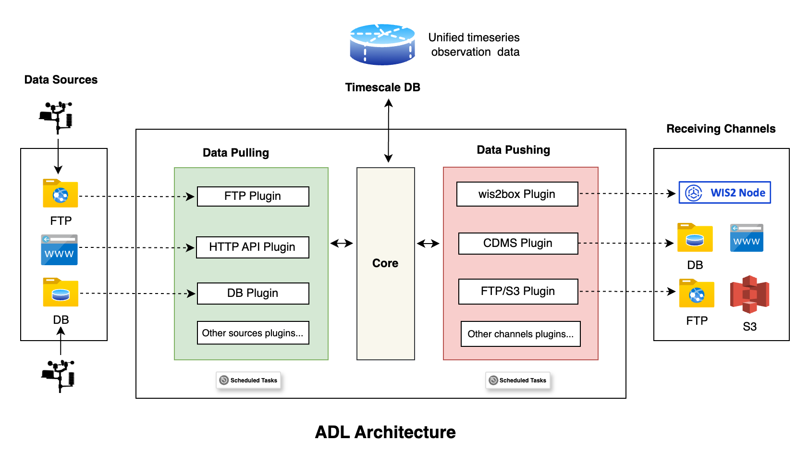

# 🏗 System Architecture

The Automated Data Loader (ADL) is a plugin based system that defines an architecture for implementing data loaders from
different observation data sources, such as Automatic Weather Stations (AWS) networks and manual stations, and pushing
the collected data to different receiving systems like wis2box, Climate Data Management Systems (CDMSs), FTP etc.

The core application, which is under this repository, defines a form of contract that vendor specific plugins can extend
and provides an abstraction layer for integration of the plugins.

At a high level, the **core** application is made up of the following components:

- **Network component**– Table and logic with details about the AWS/Manual Stations Network. A network is a
  representation of a given AWS vendor type and its stations, or a collection of manual stations. When creating a
  network, an installed plugin must be associated with it to make it useful.

- **Station component** – Table and logic with details for each station, linking to different networks, including
  defining the data parameters to be used when preparing data for sending to different channels, and a way to load
  stations for a network, from official sources like [OSCAR Surface](https://oscar.wmo.int/surface)

- **Database** – Postgres database where the system persists its data

- **Plugin Abstract** – Class that defines a contract that plugins must adhere to. This is the glue that brings diverse
  types
  of AWS vendors and sources together.

- **Background tasks** for periodically pulling data from defined sources and pushing data to receiving channels – Each
  connection is associated with a plugin. Since a plugin is standard and defines known methods of exposing its data,
  background tasks are created for each network that enable continuous checking on availability of new data and
  consequently the sending to defined receiving channels like wis2box, Climate Data Management Systems (CDMSs),FTP etc.

On the other hand, a plugin will have the following components and features:

- **Vendor/Source specific implementation** – Depending on the vendor type, the plugin will implement the specific
  features and logic it needs to be able to communicate with its storage on a periodic basis and determine if there is
  new data to be ingested.

- **Must adhere to the plugin contract** – For the plugin to be useful and accepted by the core application, it must
  implement the plugin features as defined by the core application plugin contract.

- **Linking**- A plugin should provide a user interface for connecting its stations and data parameters to the stations
  and data parameters defined in the core application. At the implementation level, a plugin can add its own tables to
  the core application database if it requires to store information needed to link its stations with the stations
  defined in the core application.

