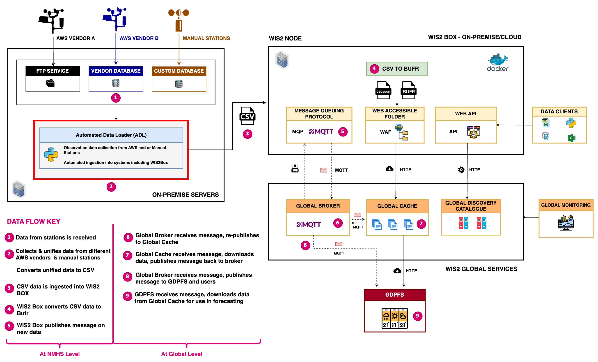

# 📚 Background

Across Africa, National Meteorological and Hydrological Services (NMHSs) face a persistent challenge in managing
observation data due to the diversity of Automatic Weather Station (AWS) types deployed through various initiatives and
donor-funded projects. Each AWS vendor typically uses proprietary formats and structures for storing and transmitting
weather data, leading to significant fragmentation in the datasets collected across national networks.

This lack of standardization makes it difficult to integrate and analyze data effectively. As a result, NMHSs often have
to rely on manual processes or develop custom scripts to extract, convert, and harmonize the data. This process is not
only time-consuming but also technically demanding—especially for countries that lack sufficient in-house technical
capacity.

Recognizing the need for a unified and scalable approach to streamline data ingestion from heterogeneous AWS systems,
the Automated Data Loader (ADL) was conceptualized as a flexible, plugin-based framework. Rather than attempting to
build a one-size-fits-all solution, ADL embraces **modularity**: a core engine manages scheduling and orchestration,
while vendor-specific plugins handle the nuances of connecting to and extracting data from each AWS type.

The same modular philosophy applies to data delivery. In addition to its original mandate—automating the ingestion of
observation data into WIS2 nodes such as wis2box, ADL now supports the development of export plugins. These allow users
to push data to a variety of destinations, including FTP servers, cloud storage (e.g., S3), APIs, and databases. This
extensibility makes ADL adaptable to the evolving data flow needs of NMHSs, enabling smooth integration into both global
data-sharing systems and national archives.

[WIS2box](https://github.com/World-Meteorological-Organization/wis2box), a reference implementation of the WMO
Information System for the 21st century (WIS 2.0), is designed to support open, real-time, and standards-based data
exchange. While deploying a WIS2 node like wis2box is becoming increasingly straightforward, ensuring that real-time
data from disparate AWS networks is consistently ingested remains a major hurdle—especially in contexts where AWS
infrastructure is fragmented. ADL bridges this gap by acting as the automation layer between observation networks and
WIS2 nodes.

The ADL goal is **to enable data to flow**—consistently, securely, and in harmonized formats—from collection points to
downstream systems that support forecasting, climate services, and early warning dissemination.

In summary, ADL helps NMHSs address the fragmentation in their AWS networks. It does this by offering a robust,
scalable, and extensible system for automating both data collection and delivery. ADL not only supports integration with
WIS2, but also enables broader national and regional data sharing efforts.

