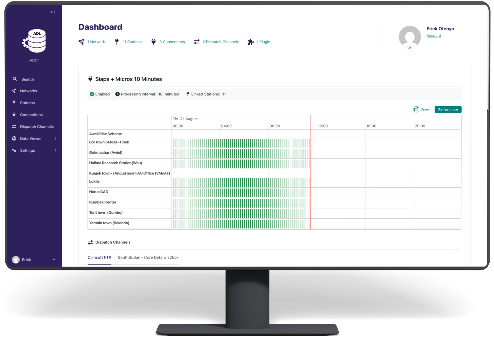

:hidetoc: 1

Welcome to the Automated Data Loader (ADL) documentation
=========================================================

ADL is a web based tool that helps to automate periodic observation data collection from different Weather Station
networks, and pushing this to different receiving systems.

Below are some of the key objects of ADL:

- Provide a tool for **automating data collection** from different weather station networks (Manual/Automatic  Weather stations)
- Provide a flexible architecture for the development of **plugins for collecting data** from different Weather Station networks ( Pull plugins)
- Provide a flexible architecture for the development of **plugins for sending collected data** to different receiving channels (Push plugins)
- Provide a **user friendly interface for managing** the data collection and pushing process.

Index
------

.. toctree::
   :maxdepth: 2
   :titlesonly:

   background
   architecture
   technology
   core_concepts
   installation
   environmental_variables
   user_guide/index
   plugins/index

