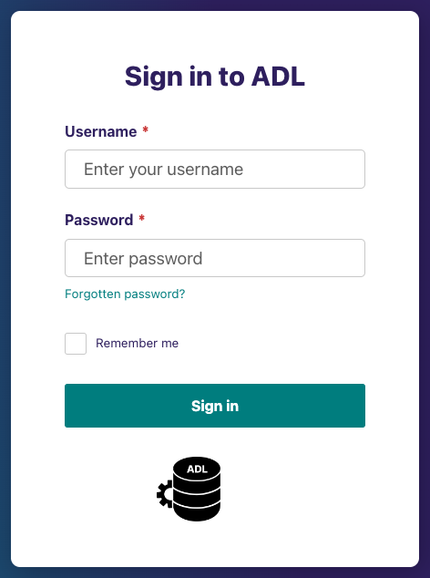
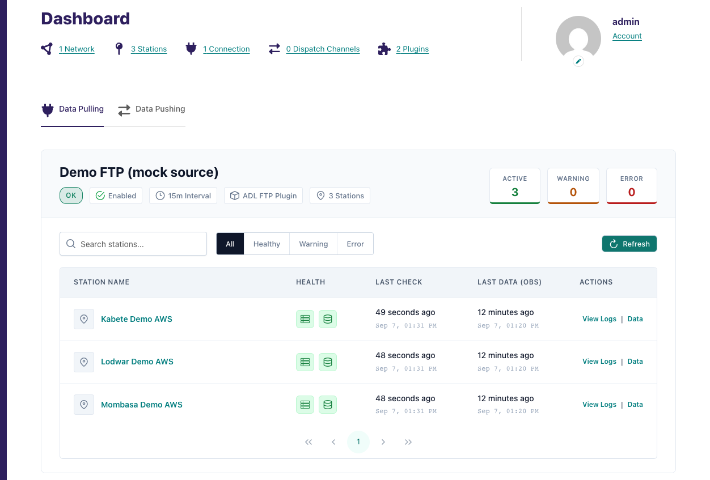
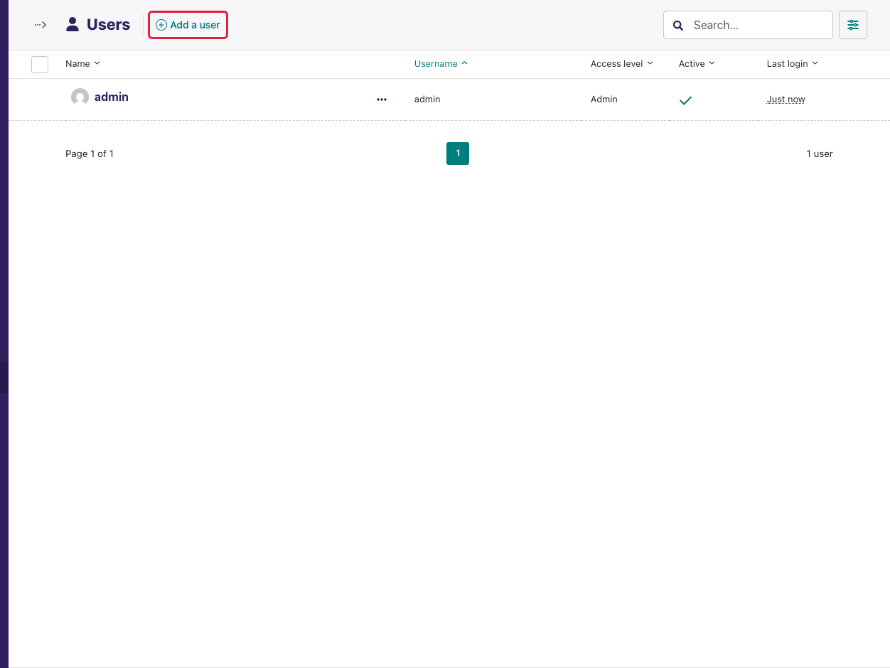
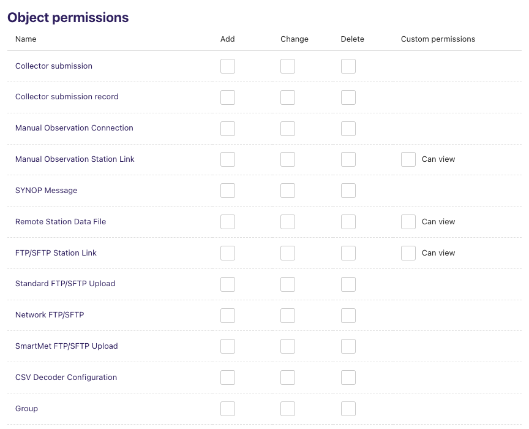

(admin-access)=

# Access the Admin Interface

Everything in ADL is configured and monitored through its web admin. This
page covers how to reach it, how to sign in for the first time, what the
home page shows, how to add colleagues, and which permission unlocks the
manual action buttons.

## The admin URL

The admin is served at the **root** of the ADL site:

```
http://<ip_or_domain>:<ADL_WEB_PROXY_PORT>/
```

- `<ip_or_domain>` — the IP address or host name of the machine running ADL.
- `<ADL_WEB_PROXY_PORT>` — the port from `ADL_WEB_PROXY_PORT` in `.env`
  (default `80`, in which case omit it).

For example, with the IP `192.0.2.10` and the default port, open
`http://192.0.2.10/`. When ADL sits behind a reverse proxy with a domain and
TLS (see [SSL setup](../ssl-setup-nginx-proxy-manager.md)), use
`https://adl.example.org/`.

An unauthenticated visit redirects to the login page at `/login/`.


<!-- screenshot: manifest entry user/admin/login_page -->

## First sign-in: the superuser

ADL ships with no accounts. Create the first one on the server:

```bash
make createsuperuser
# or, without the Makefile:
docker compose exec adl adl createsuperuser
```

Follow the prompts for username, email and password, then sign in with
those credentials. A superuser can do everything; use it to set up the
instance and to create the day-to-day accounts described below.

```{tip}
Forgotten a password? There is no email server configured by default, so the
*Forgotten password* link on the login page cannot send a reset. Reset it
from the server instead:

    docker compose exec adl adl changepassword <username>
```

## The home page

After signing in you land on the dashboard.



From top to bottom:

1. **Summary counters** — how many *Networks*, *Stations*, *Connections*,
   *Dispatch Channels* and *Plugins* the instance has. Each is a link to the
   corresponding list.
2. **Activity panel** — two tabs, *Data Pulling* and *Data Pushing*, with
   one card per connection or dispatch channel showing its health and the
   status of every station. This is the fleet-wide monitoring view; it is
   described in full in
   {ref}`Monitoring & Diagnostics <monitoring-dashboard>`.

The **sidebar** on the left is the navigation for everything else:

| Menu entry | What it manages | Guide |
|---|---|---|
| **Networks** | Groups of stations by vendor or collection method | [Manage Networks](manage_networks.md) |
| **Stations** | The stations themselves, with WIGOS identifiers and metadata | [Manage Stations](manage_stations.md) |
| **Connections** | How ADL reaches each data source, per plugin | [Manage Connections](manage_connections.md) |
| **Dispatch Channels** | Where collected data is sent | [Manage Dispatch Channels](manage_dispatch_channels.md) |
| **Settings → Units** | Measurement units | [Manage Data Parameters](manage_data_parameters.md) |
| **Settings → Data Parameters** | The variables ADL stores | [Manage Data Parameters](manage_data_parameters.md) |
| **Settings → Users / Groups** | Accounts and permissions | This page, below |

Installed plugins have no sidebar entry of their own; open the **Plugins**
counter on the home page — see [Manage Plugins](manage_plugins.md).

## Adding users

Go to **Settings → Users** and click **Add a user**. Fill in username, email,
name and password, then choose the user's **groups** on the *Roles* tab.
Accounts can be deactivated rather than deleted, which keeps the audit trail
of who changed what.


<!-- screenshot: manifest entry user/admin/users_list -->

Two account types exist:

- **Superuser** (the *Administrator* checkbox) — bypasses every permission
  check. Reserve for the people who install and upgrade ADL.
- **Regular user** — can do exactly what their groups allow.

## Groups and permissions

Permissions are assigned to **groups**, and users inherit them. Go to
**Settings → Groups**, create a group (for example *Data operators*), and
tick the object permissions it should have. ADL's objects appear in the
*Object permissions* table with the usual *Add*, *Change*, *Delete* columns:


<!-- screenshot: manifest entry user/admin/group_permissions -->

Every group also needs **Can access Wagtail admin** (under *Other
permissions*) or its members cannot sign in at all.

```{important}
**One permission unlocks the manual action buttons.** *Trigger Collection
Now* on a station link, *Probe source now* and *Run ingestion now* on the
Ingestion Diagnostic, and *Dispatch now*, *Test connection* and the lock
controls on a dispatch channel are all shown only to users holding the
**Change** permission for that connection type or channel type (for example
*Change FTP connection*). A user with view-only rights sees the pages and the
verdicts but no buttons. There is no separate "may press buttons"
permission to hunt for.
```

Because connections and channels are registered per plugin type, the
permission rows are also per type: granting *Change FTP connection* does not
grant *Change PulsoWeb connection*. A group meant to operate everything
needs the row for each installed plugin, or the generic *Network
connection* / *Dispatch channel* rows, which cover all types.

Suggested starting groups:

| Group | Permissions | Who |
|---|---|---|
| **Monitoring** | Admin access only, plus *View* on connections and channels | Forecasters and managers who watch the dashboard |
| **Data operators** | *Add / Change* on stations, station links, connections and dispatch channels of the plugins in use | Staff who onboard stations and fix credentials |
| **Administrators** | Superuser | The installer and their backup |

## Language

The admin is translated into Amharic, Arabic, English, Spanish, French and
Swahili. The instance default comes from `LANGUAGE_CODE` in `.env` (see
[Environment variables](../environmental_variables.md)); each user can
override it under **Account** (the user menu at the bottom of the sidebar)
→ **Preferred language**.

## Is the admin exposed to the Internet?

Only if you expose it. ADL runs entirely on your infrastructure and shares
nothing unless a dispatch channel is configured — see
[Data flow and access control](../data-flow-and-access-control.md). If the
admin must be reachable from outside your network, put it behind TLS and
restrict the source addresses at the firewall or proxy.
