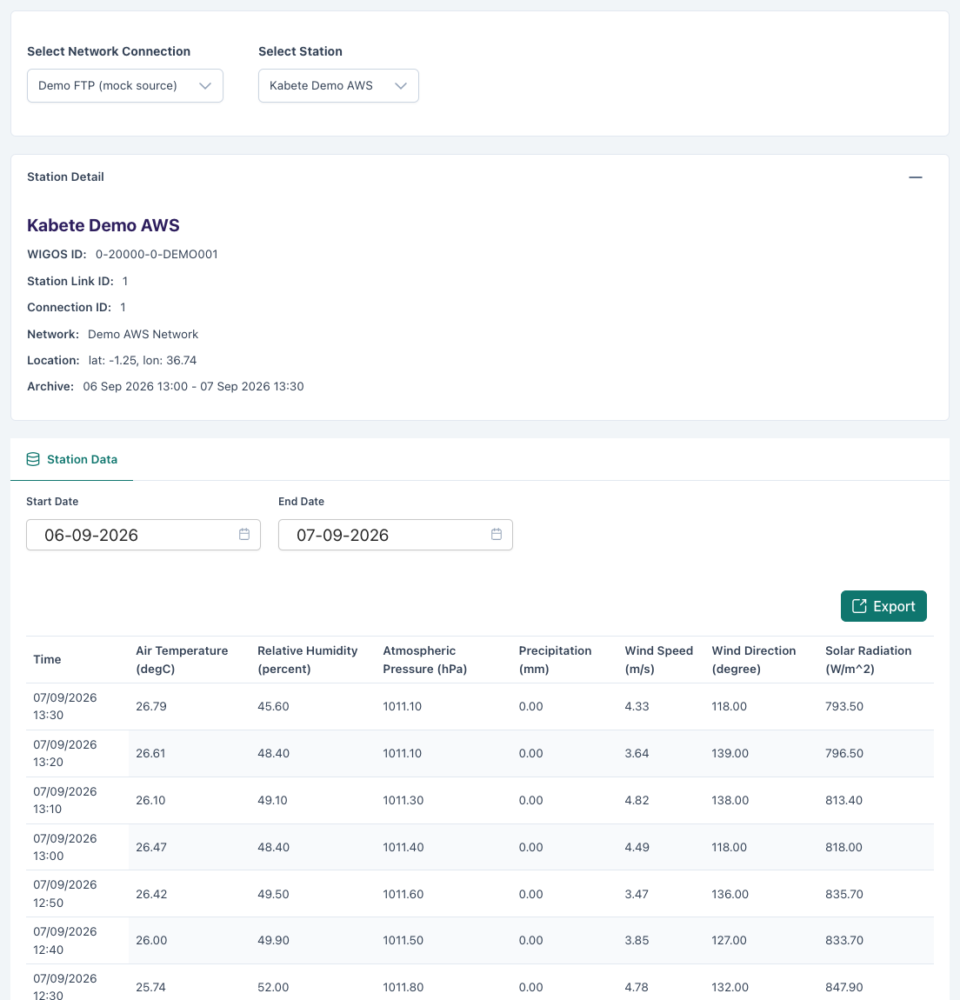
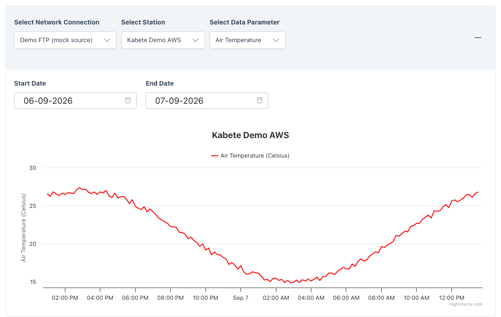
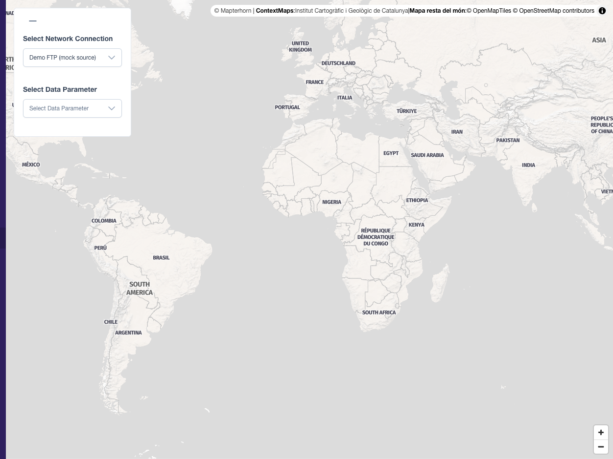
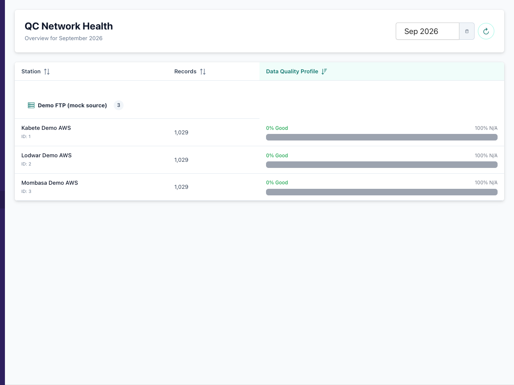

(data-viewer)=

# Data Viewer

The **Data** menu in the sidebar opens the built-in viewer: a table, a chart
and a map of stored observations, a quality-control overview, and
configurable display widgets for a screen in the forecast office. It reads
the same [REST API](../api.md) that external systems use, so what it shows
is exactly what is stored.

| Menu entry | Page | What it is for |
|---|---|---|
| **Data → Table** | `/viewer/table/` | Browse one station's records for a day range; export CSV. |
| **Data → Chart** | `/viewer/chart/` | Plot one parameter over time, several panels side by side. |
| **Data → Map** | `/viewer/map/` | See every station's latest value of a parameter on a map, or the value at a chosen time. |
| **Data → Quality Control** | `/viewer/qc/status/` | Per-station QC flag statistics for a month, with a drill-down inspector. |
| **Data → Display Widgets** | `/widget-display/` | Configure unattended, auto-rotating displays. |
| **Data → Settings → TileServer** | | Re-index the map tile server after schema changes. |

There are also **View Data** shortcuts straight into the table from every
place in the admin that names a station: the station links list row menu,
the station link Inspect page header, the station monitoring page, and the
dashboard's station rows.

## Table


<!-- screenshot: manifest entry user/viewer/table -->

1. **Select Connection**, then **Select Station** — the station list is the
   connection's station links.
2. Pick a **category** (Meteorological, Environmental, Station Health,
   Communication) to limit the columns.
3. Pick the **from / to** dates. They are clamped to the station's archive:
   the station detail card shows the earliest and latest stored times.
4. The table lists one row per observation time, one column per parameter,
   values in each parameter's ADL unit. **Export** downloads the current
   selection as CSV.

The page keeps its state in the URL. `…/viewer/table/?station=42` always
means "that station link's latest day", and the full form is
`?connection=&station=&category=&from=YYYY-MM-DD&to=YYYY-MM-DD`; bookmark
or share it. Values that no longer apply (a deleted station, a date outside
the archive) fall back to defaults and are listed in one dismissible banner.

## Chart


<!-- screenshot: manifest entry user/viewer/chart -->

Each **panel** plots one parameter of one station over a date range. **Add
Chart** adds a panel, so a temperature trace and a humidity trace, or the
same parameter at two stations, sit side by side. Panels are encoded in the
URL as repeatable `chart=<connection>:<stationLink>:<parameter>:<from>:<to>`
parameters, so a multi-panel comparison survives copy-paste.

## Map


<!-- screenshot: manifest entry user/viewer/map -->

Choose a **connection** and a **data parameter**. Every station on the
connection is drawn at its location, coloured by its **latest** value of
that parameter on a colour scale shown in the legend. Click a station for
its value and time.

The **time controls** at the bottom switch from *latest* to a chosen
instant: drag to an hour mark and the map shows, for each station, the value
nearest that time. Hours in the future are marked as such and carry no data.

The map is framed on the country set in **Settings → ADL Settings →
Country**. Colour scales per parameter are configured in **Settings → Map
Viewer Settings → Map Styles**: one row per parameter with a gradient of
value → colour stops from low to high (for example 0 °C blue, 20 °C green,
40 °C red). A parameter without a style uses a default scale.

The station symbols are vector tiles served by the `adl_pg_tileserv`
container. If stations stop appearing after an upgrade, open **Data →
Settings → TileServer** and press the reload button, which re-reads the
tile functions from the database.

## Quality Control


<!-- screenshot: manifest entry user/viewer/qc_status -->

**QC Network Health** lists every station with, for the chosen month
(default: the latest month with data), its record count and a **Data
Quality Profile** — how many records passed and how many were flagged by
the range, step, persistence and spike checks configured on each parameter
(see {ref}`Quality control checks <quality-control-checks>`).

Click a station to open the **Station Inspector** for that month: the time
series with flagged values highlighted, per parameter, so you can see
whether a spike was one bad reading or a sensor that has drifted. *No QC
data found for this month* means no records exist for it.

Flagged values are still stored and still dispatched; QC marks, it does not
delete. Use the inspector to decide whether a sensor needs attention.

## Display widgets

A **Widget Display** is a stand-alone, sign-in-free page meant for a wall
screen. Go to **Data → Display Widgets → Add Widget Display**:

| Field | Description |
|---|---|
| **Name** | For the list. |
| **Default view** | *Rotating Cards + Mini Map* cycles through the chosen stations, one card of current values at a time, with a small map; *Full Map Overlay* shows the map with all stations and their values. |
| **Rotation interval** | Seconds each station card stays on screen (default 10). |
| **Poll interval** | Minutes between data refreshes (default 5). |
| **Stations** | Which station links to show. |
| **Parameters** | Which parameters to show on the cards. |

The list's **Display URL** column gives each widget its public address
(`/display/widget/<id>/`). Open it full-screen on the display device. The
page shows the organisation name and logo from **Settings → ADL Settings**
in its footer.

```{note}
Display URLs do not require sign-in, so anyone who can reach the ADL host
can see the stations and parameters you put on a widget. Keep the host
inside your network, or choose the stations accordingly.
```
