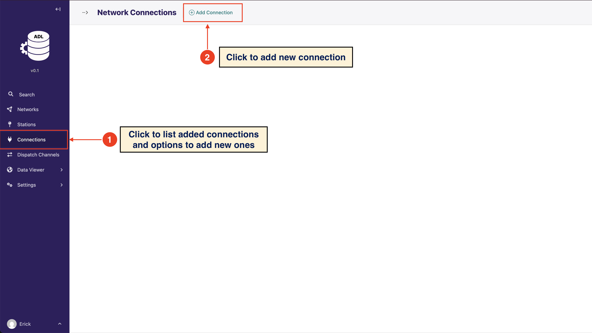
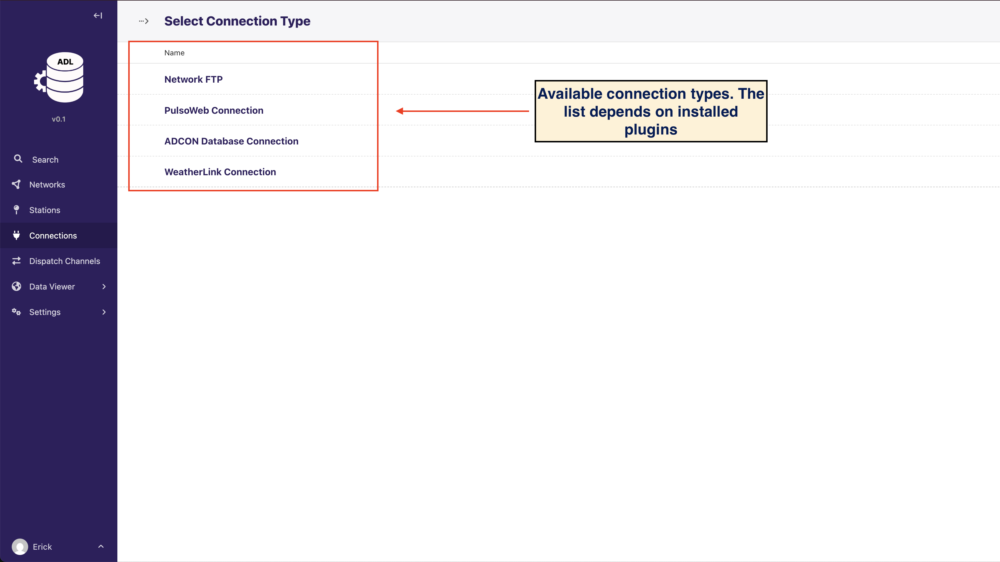
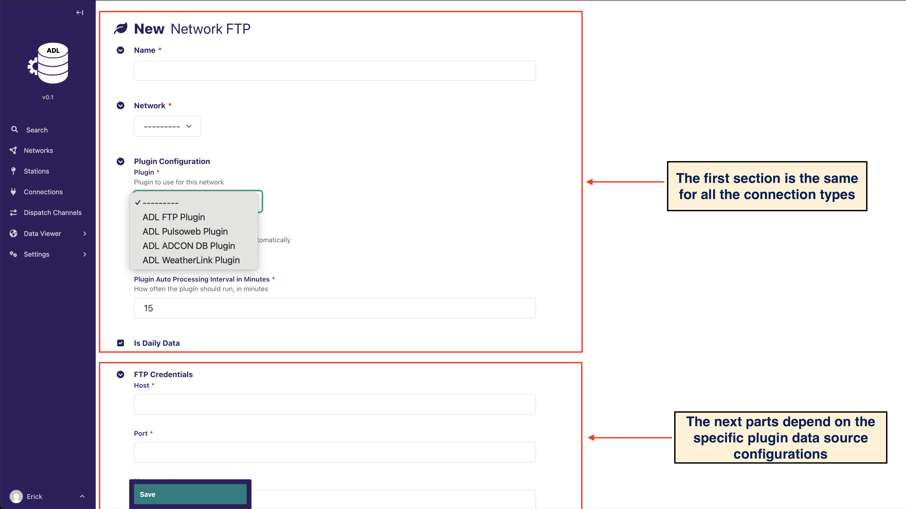

# Manage Connections

## Overview

A `Connection` bridges the gap between your physical weather stations and ADL. It contains the technical configuration
that a plugin needs to communicate with and retrieve data from a specific data source.

**How connections, plugins, and networks work together:**

1. **Network**: Represents a group of stations (e.g., "Davis Vantage Stations" or "Manual Observations")
2. **Connection**: Provides the technical details to access station data (FTP server, database credentials, API
   endpoints)
3. **Plugin**: Uses the connection to actually fetch data and translate it into ADL's format
4. **Stations**: Individual weather stations within the network that share the same connection

**Example workflow:**

- You have 10 Davis Vantage Pro2 stations that upload data to an FTP server
- You create one Network: "Davis Stations"
- You create one Connection with FTP server details (host, port, credentials)
- You associate this connection with the Davis plugin
- The plugin uses this connection to fetch data for all 10 stations

A `Connection` contains the configuration required for a plugin to communicate and get data from a specific source.

Depending on the plugin, the connection can include information like the host URL or IP, port etc for communication
protocols like FTP,HTTP, Database connections etc







```{note}
A network connection must be associated with a plugin, that implements the actual data fetching. You can select the
plugin to associate with the network connection by selecting from the `Plugin` dropdown. This will be a list of plugins
that have been installed.
```
