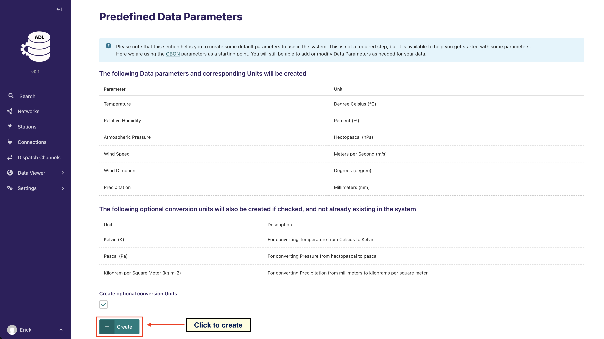
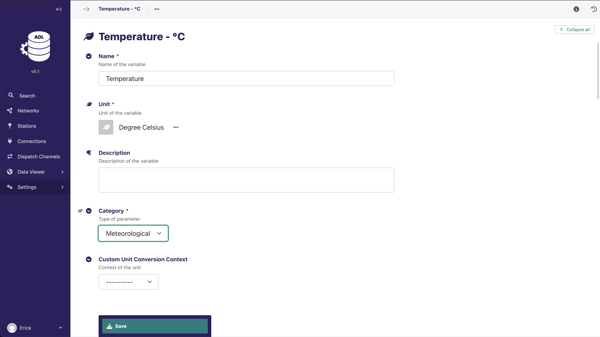
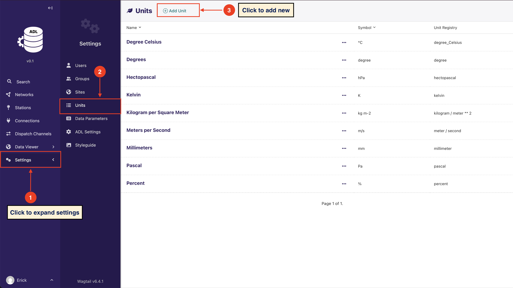
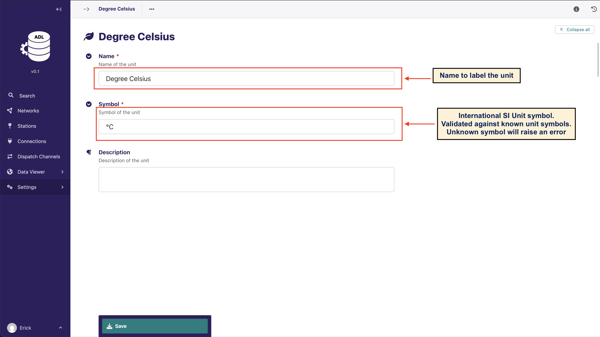

# Manage Data Parameters

ADL is dynamic and allows you to add data parameters that are required for your stations data. This means that before
you can start collecting data, you need to know the observation data parameters that your stations are collecting, and
define them in the system. A data parameter also contains unit information for data conversion purposes

To help you get started, the system provides a way to quickly load data parameters from a small predefined list of core
meteorological parameters. This option is only provided when no data parameters have been added to the system.

You can add or edit data parameters as below:

A Data Parameter must be associated with a unit. The system provides a form to add and edit units

