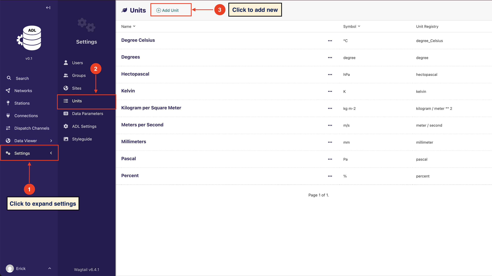
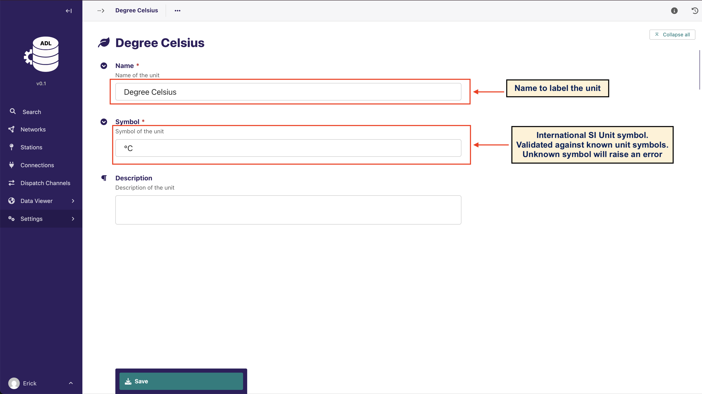
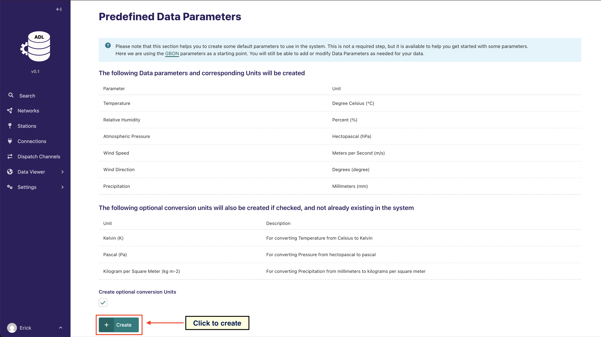
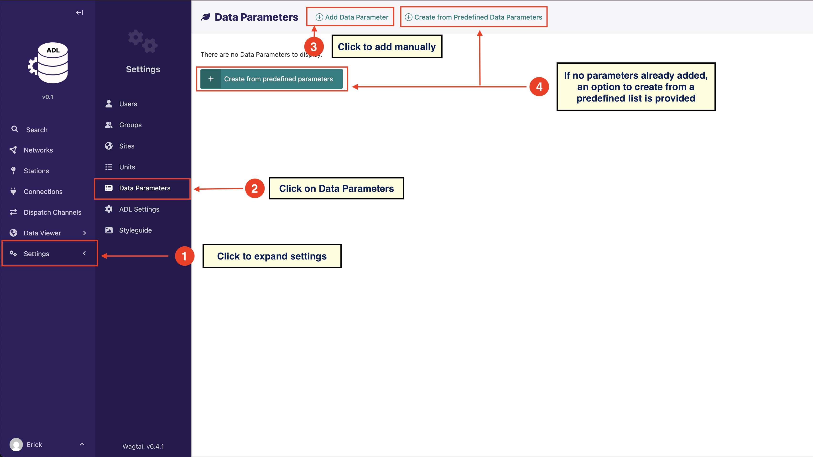
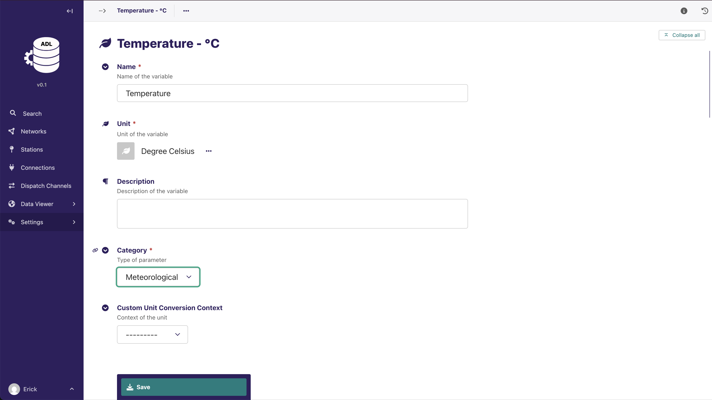
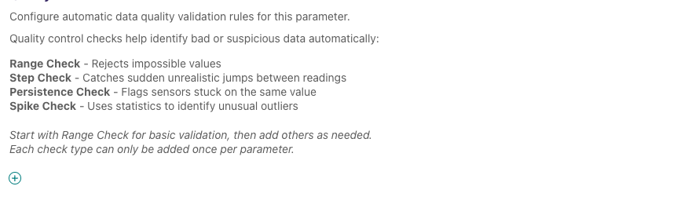

(manage-data-parameters)=

# Manage Data Parameters

A **data parameter** is one variable ADL stores: air temperature, rainfall,
wind speed, relative humidity and so on. Every observation record in ADL is
a value of one parameter, for one station, at one time, in that parameter's
**unit**.

Plugins never invent variables. When a plugin fetches data, the operator maps
each source-side variable (a column name, an API code, a sensor id) to one of
these parameters, and ADL converts the incoming value into the parameter's
unit before storing it. Dispatch channels map parameters back out to the
destination's names and units the same way. Defining parameters up front is
what makes ten vendors' data land in one consistent schema.

Both parameters and their units live under **Settings** in the sidebar.

## Units

Go to **Settings → Units**. Every parameter needs a unit, so create the
units first (or load the predefined set, below, which creates them for you).



| Field | Required | Description |
|---|---|---|
| **Name** | yes | Human name, unique — *Degree Celsius*, *Millimeters*. |
| **Symbol** | yes | The unit as the [pint](https://pint.readthedocs.io) unit registry knows it, unique. This is what drives conversion, so it must be a symbol pint recognises. |
| **Description** | no | Free text. |

The list shows a third column, **Unit Registry**, with the canonical pint
form of the symbol you typed (for example `°C` → `degree_Celsius`) — a
quick way to confirm the symbol was understood.

Symbols that work: `degC` or `°C`, `K`, `degF`, `%`, `hPa`, `Pa`, `mbar`,
`mm`, `m`, `m/s`, `km/h`, `knot`, `degree`, `W/m^2`, `kg m-2`.

Saving a symbol pint does not know fails with
*'&lt;symbol&gt;' is not defined in the unit registry*. Check the spelling
against the pint documentation; `mm/hr`, for instance, must be written
`mm/h`.



```{note}
If values look wrong after ingestion (a temperature of 300, a pressure of
101325), the source-side unit on the plugin's variable mapping does not
match what the source actually sends, and ADL converted from the wrong unit.
The fix is on the mapping, not here.
```

## Loading the predefined parameters

On a fresh instance the **Data Parameters** list is empty and offers a
**Create from Predefined Data Parameters** button. It creates the six core
GBON parameters and their units in one step, so you can start mapping
immediately. The button disappears once any parameter exists.



| Parameter | Unit | Also created with *conversion units* ticked |
|---|---|---|
| Temperature | Degree Celsius (`°C`) | Kelvin (`K`) — WIS2Box expects Kelvin |
| Relative Humidity | Percent (`%`) | — |
| Atmospheric Pressure | Hectopascal (`hPa`) | Pascal (`Pa`) — WIS2Box expects pascal |
| Wind Speed | Meters per Second (`m/s`) | — |
| Wind Direction | Degrees (`degree`) | — |
| Precipitation | Millimeters (`mm`), with the *precipitation* conversion context | Kilogram per Square Meter (`kg m-2`) — WIS2Box expects kg/m² |

Tick **Create conversion units** if you will dispatch to WIS2Box: the extra
units are what you select on the WIS2Box channel's parameter mappings. The
page confirms with *Predefined parameters created successfully.* You can
edit or delete any of the six afterwards.

## Adding and editing a parameter

Go to **Settings → Data Parameters** and click **Add Data Parameter**, or
click an existing name to edit it.



| Field | Required | Default | Description |
|---|---|---|---|
| **Name** | yes | — | Unique variable name. Shown in every mapping dropdown, so keep it readable: *Air Temperature*, *Precipitation (1h)*. |
| **Unit** | yes | — | The unit values are **stored** in. Incoming values in other units are converted to this. |
| **Description** | no | — | Free text. |
| **Icon** | no | — | Icon shown beside the parameter in dashboards and the data viewer. |
| **Category** | yes | Meteorological | *Meteorological*, *Environmental*, *Station Health* (battery voltage, panel temperature) or *Communication* (signal strength). Used to group parameters in viewers. |
| **Custom Unit Conversion Context** | no | — | For conversions pint cannot do dimensionally. The one shipped context is **Precipitation**, which lets `mm` convert to and from `kg/m²`. Set it on rainfall parameters. |
| **Aggregation Method** | yes | Standard | How hourly summaries are computed. *Standard* gives min/max/avg/sum. Choose **Circular Mean** for angular variables such as wind direction, so 350° and 10° average to 0°, not 180°. |
| **Is Coded Value** | no | off | Tick when values are WMO code-table integers (cloud cover in oktas, present weather) rather than measurements. Unit conversion is skipped and the manual entry form shows a dropdown. |
| **WMO Code Table** | no | — | The table the dropdown is built from, for coded parameters: `2700` for cloud cover in oktas, `0513` for low cloud type. Leave blank for physical quantities. |
| **Quality Control Checks** | no | none | The automatic validation rules applied to every incoming value. See below. |



```{warning}
**The unit of a parameter cannot be changed once it has data.** Saving with
a different unit fails with *Cannot change the unit of a parameter that
already has observation records.* Create a new parameter instead, or delete
the records first. This protects stored history from being silently
reinterpreted in another unit.
```

(quality-control-checks)=

## Quality control checks

The **Quality Control Checks** field is a list: click the **+** and add as
many checks as you need, of four kinds. A value that fails a check is still
stored, but flagged, and the failure is written to the run's activity log.


<!-- screenshot: manifest entry user/parameters/qc_checks -->

| Check | Catches | Settings |
|---|---|---|
| **Range Check** | Physically impossible values | *Minimum* and *Maximum* acceptable value (either may be blank); whether the limits themselves are acceptable. |
| **Step Check** | Sudden jumps between consecutive readings, typical of a failing sensor | *Maximum jump* between readings; optional *maximum rate of change per minute*; *ignore after a gap* longer than N minutes so a restart after an outage is not flagged. |
| **Persistence Check** | A stuck sensor reporting the same value | *Number of identical consecutive readings* before flagging; *tolerance* for "identical"; whether repeated zeros are allowed (tick for rainfall). |
| **Spike Check** | Statistical outliers against recent behaviour | *Standard deviations* from normal before flagging (3.0 is lenient, 2.0 strict); *window* of previous readings; *minimum readings* before the check starts. |

Start with a Range Check on every parameter (for example −50 to 60 for air
temperature in °C, 0 to 100 for humidity, 0 to 500 for hourly rainfall in
mm) and add the others where a sensor type is known to misbehave.

## How parameters are used

- **Ingestion** — each plugin's connection or station link has *variable
  mappings*: one row per source variable, choosing the ADL parameter and the
  unit the source sends. See [Manage Plugins](manage_plugins.md) and the
  plugin's own guide.
- **Dispatch** — each dispatch channel has *parameter mappings* that
  translate ADL parameters to the destination's names and units. See
  [Manage Dispatch Channels](manage_dispatch_channels.md).
- **Viewing** — the data viewer and the station *View Data* pages group and
  chart observations by parameter, using the icon and category set here.

Deleting a parameter deletes its observation records and removes it from
every mapping; the list asks for confirmation first.
