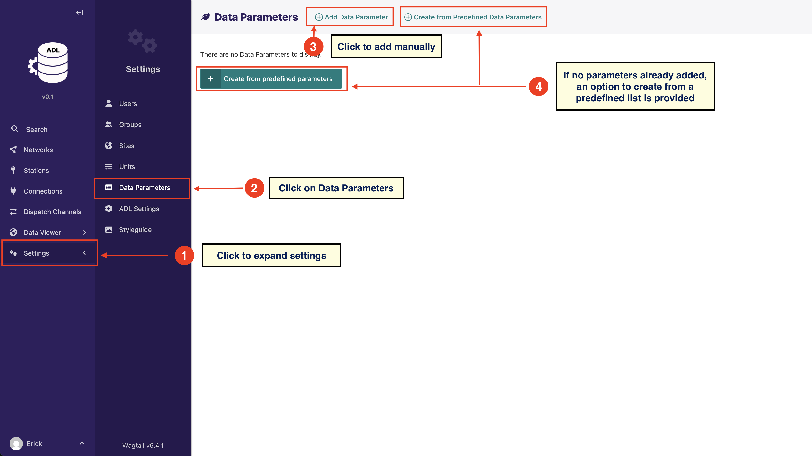

# Manage Data Parameters

## Overview

Data parameters define the types of observations your weather stations collect. Before ADL can store or process station
data, it needs to know what measurements to expect - temperature, rainfall, wind speed, humidity, etc.

Each data parameter includes:

- **Name and description**: What the parameter measures
- **Unit information**: For data conversion and standardization
- **Metadata**: Additional context for the observation type

**Why define parameters upfront?**
When plugins fetch data from your stations, they map the incoming observations to these predefined parameters. This
ensures:

- Consistent data structure across different station types
- Proper unit conversions when stations report in different units
- Accurate data validation and quality control

To help you get started, the system provides a way to quickly load data parameters from a small predefined list of core
meteorological parameters. This option is only provided when no data parameters have been added to the system.

You can add or edit data parameters as below:

A Data Parameter must be associated with a unit. The system provides a form to add and edit units

