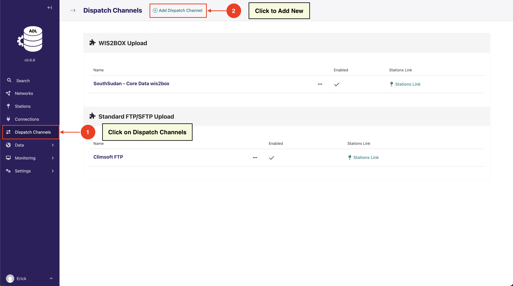
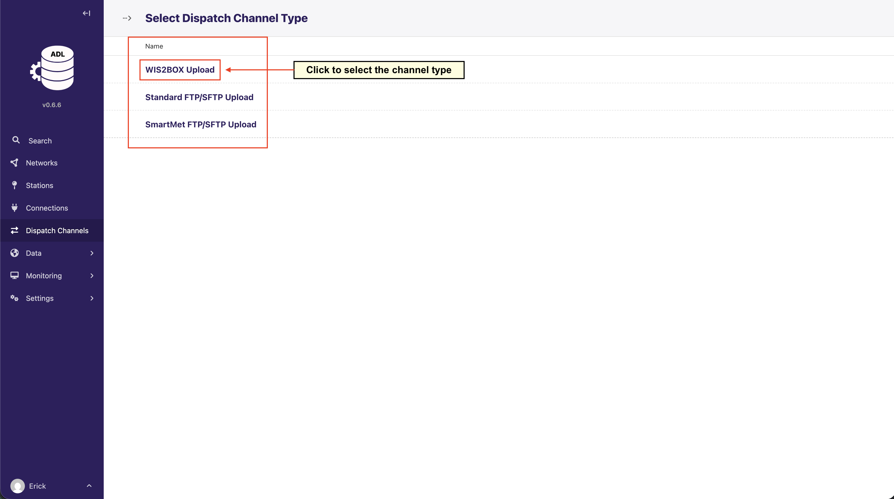
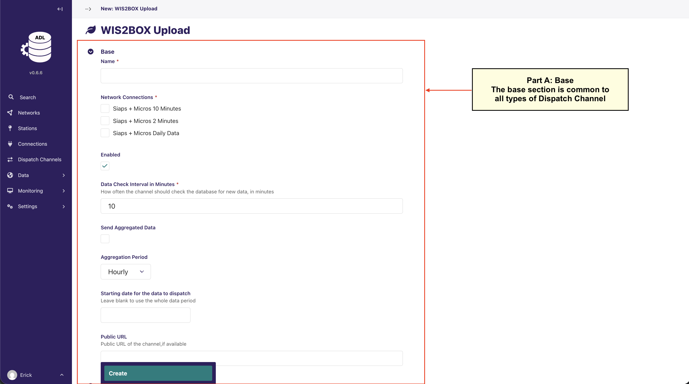
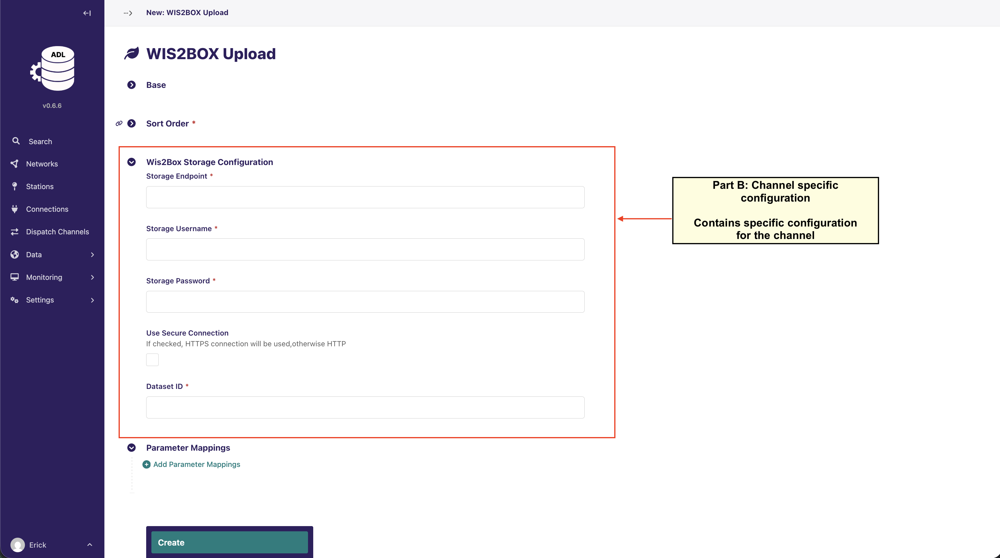
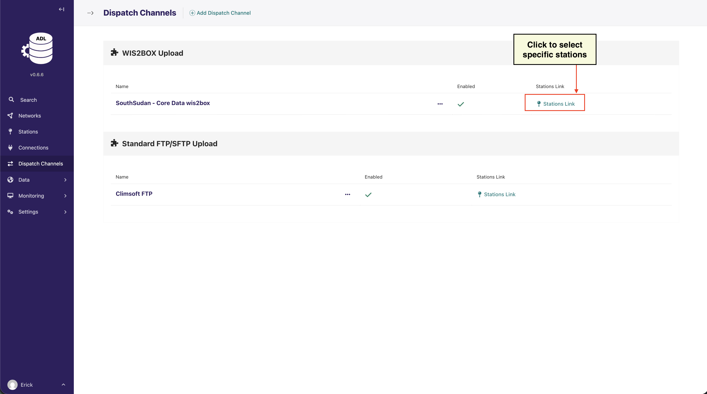

## Available Dispatch Channel Types

ADL supports the following dispatch channel types:

- **WIS2BOX Upload**: Publishes observation data to WMO WIS2 infrastructure
- **Standard FTP/SFTP Upload**: Uploads data files to FTP or SFTP servers
- **SmartMet FTP/SFTP Upload**: Specialized upload for SmartMet weather systems

```{note}
The configuration fields you see will vary depending on which dispatch channel type you select. 
Each channel type has its own specific requirements and configuration options.
```

## Adding a Dispatch Channel

### Step 1: Navigate to Dispatch Channels

Click on **Dispatch Channels** in the left sidebar.



### Step 2: Add New Dispatch Channel

Click the **Add Dispatch Channel** button.



### Step 3: Select Dispatch Channel Type

Choose the type of dispatch channel based on your destination system.


## Configuring a Dispatch Channel

The configuration form is divided into sections. **Part A (Base Configuration)** is common to all channel types,
while **Parts B and C** contain fields specific to the selected channel type.

### Part A: Base Configuration (Common to All Channel Types)

This section appears for all dispatch channel types:



- **Name**: A descriptive name for the dispatch channel
- **Network Connections**: Select which network connections this channel should dispatch data from
    - **By default, ALL station links from the selected network connections will be included**
    - You can optionally refine this selection to specific stations later (
      see [Linking Stations](#linking-stations-to-dispatch-channels))
- **Enabled**: Toggle to activate/deactivate the channel
- **Data Check Interval in Minutes**: How often the channel should check for new data to dispatch
- **Send Aggregated Data**: Option to send aggregated data instead of raw observations
- **Aggregation Period**: If sending aggregated data, select the aggregation period (Hourly, Daily, etc.)
- **Starting date for data to dispatch**: Leave blank to dispatch all available data, or specify a start date
- **Public URL**: Public URL of the channel, if available

```{important}
When you select network connections in Part A, 
you're determining the scope of stations that will send data through this channel. 
Only station links associated with the selected network connections will be eligible for dispatching.
```

### Part B: Channel-Specific Configuration

**The fields in this section vary depending on the dispatch channel type you selected.**

#### Example: WIS2BOX Upload Configuration



For **WIS2BOX Upload** channels, you'll configure:

- **Storage Endpoint**: The WIS2Box storage endpoint URL
- **Storage Username**: Authentication username
- **Storage Password**: Authentication password
- **Use Secure Connection**: Enable HTTPS connection
- **Dataset ID**: The dataset identifier in WIS2Box

```{important}
If you select a different channel type (such as Standard FTP/SFTP Upload or SmartMet FTP/SFTP Upload), 
you will see different configuration fields appropriate to that channel type. For example, 
FTP channels will require fields like host, port, directory paths, and connection credentials 
specific to FTP/SFTP protocols. Check the documentation for your chosen channel type for detailed configuration 
instructions.
```

### Part C: Parameter Mappings

Map ADL data parameters to the format expected by the destination system:


For each parameter mapping:

- **Parameter**: Select the ADL data parameter (e.g., Temperature, Rainfall)
- **Channel Parameter**: Enter the parameter name expected by the destination system
- **Channel Unit**: Specify the unit expected by the destination (leave empty if same as ADL)
- **Aggregation Measure**: Select how to aggregate the data (Average Value, Sum, Min, Max, etc.)

Click **Add Parameter Mappings** to add additional parameter mappings as needed.

```{note}
The parameter mapping section allows you to transform ADL's internal parameter names and units to match what 
your destination system expects. This ensures compatibility across different systems and standards.
```

### Step 4: Save the Dispatch Channel

Click the **Create** button to save your dispatch channel configuration.

## Linking Stations to Dispatch Channels

After creating a dispatch channel, link stations whose data should be dispatched:

1. From the Dispatch Channels list, click on the **Stations Link** for the desired channel
2. Select the stations you want to link to this dispatch channel
3. Save your selection



```{note}
A single station can be linked to multiple dispatch channels, and a dispatch channel 
can dispatch data from multiple stations.
```

## Managing Dispatch Channels

From the Dispatch Channels index page, you can:

- **Enable/Disable**: Toggle channels on or off using the Enabled column
- **Edit**: Click the menu (•••) to edit channel configuration
- **View Station Links**: Click the **Stations Link** to manage which stations use this channel
- **Delete**: Remove channels that are no longer needed