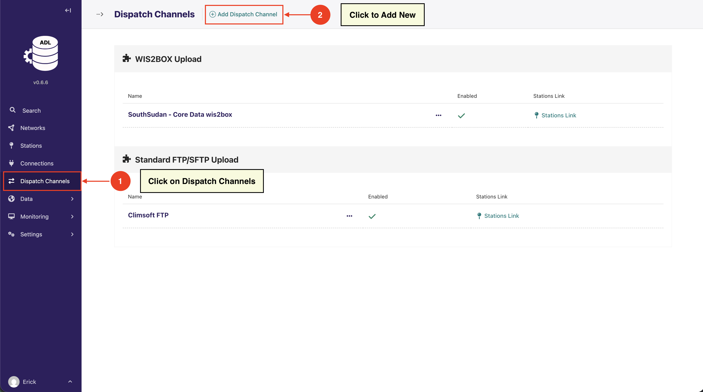
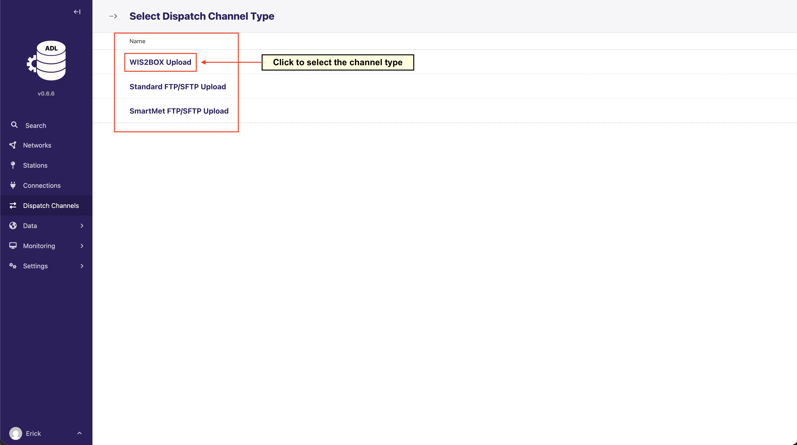
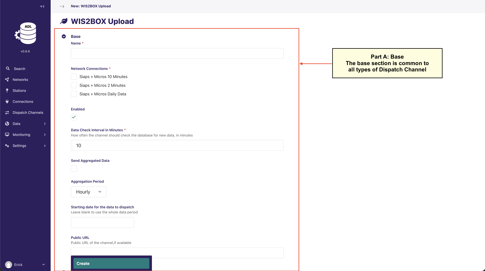
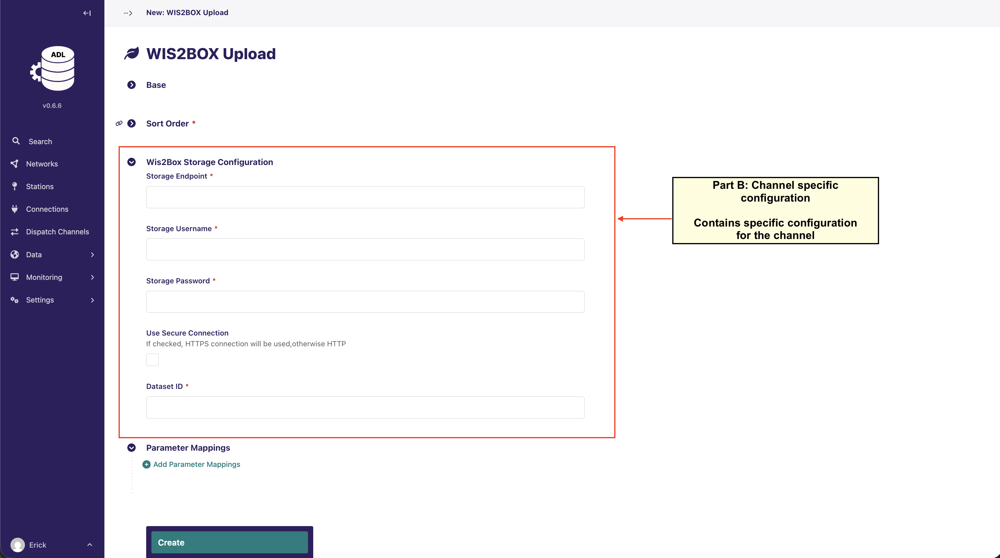
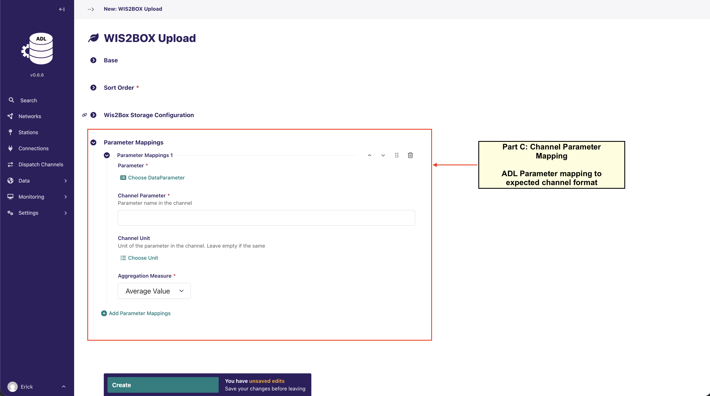
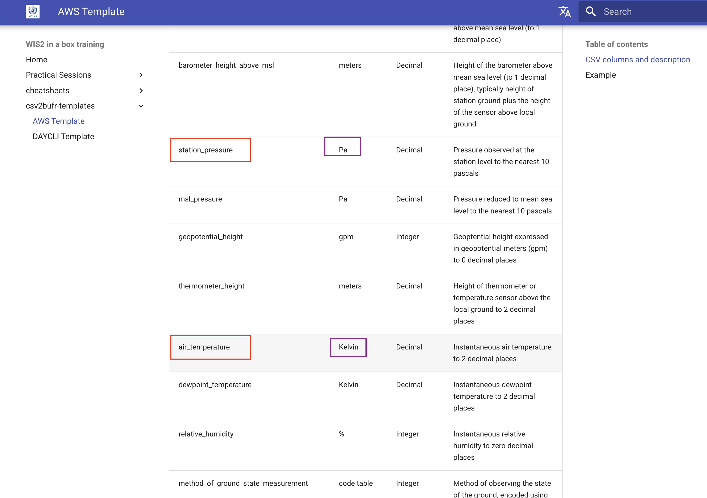
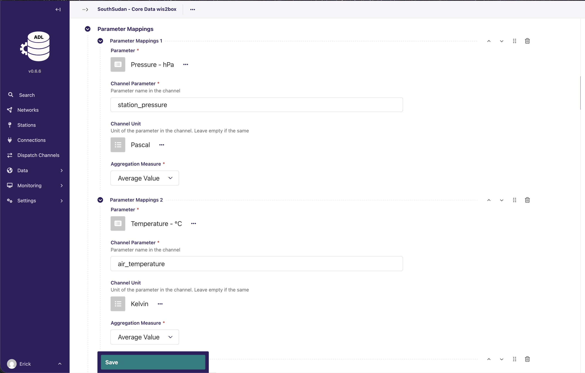
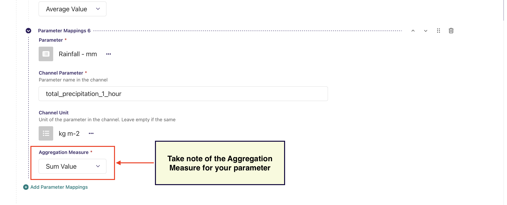
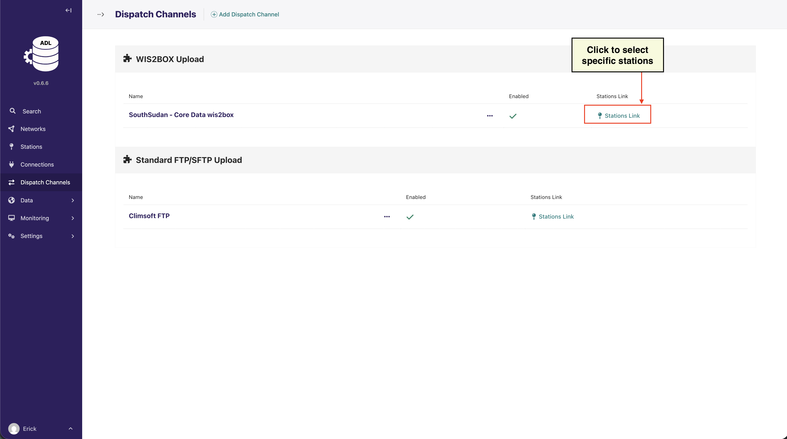
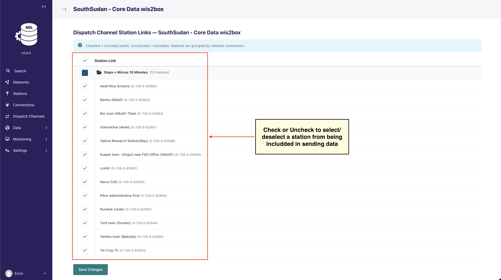

## Available Dispatch Channel Types

ADL supports the following dispatch channel types:

- **WIS2BOX Upload**: Publishes observation data to WMO WIS2 infrastructure
- **Standard FTP/SFTP Upload**: Uploads data files to FTP or SFTP servers
- **SmartMet FTP/SFTP Upload**: Specialized upload for SmartMet weather systems

```{note}
The configuration fields you see will vary depending on which dispatch channel type you select. 
Each channel type has its own specific requirements and configuration options.
```

## Adding a Dispatch Channel

### Step 1: Navigate to Dispatch Channels

Click on **Dispatch Channels** in the left sidebar.



### Step 2: Add New Dispatch Channel

Click the **Add Dispatch Channel** button.



### Step 3: Select Dispatch Channel Type

Choose the type of dispatch channel based on your destination system.


## Configuring a Dispatch Channel

The configuration form is divided into sections. **Part A (Base Configuration)** is common to all channel types,
while **Parts B and C** contain fields specific to the selected channel type.

### Part A: Base Configuration (Common to All Channel Types)

This section appears for all dispatch channel types:



- **Name**: A descriptive name for the dispatch channel
- **Network Connections**: Select which network connections this channel should dispatch data from
    - **By default, ALL station links from the selected network connections will be included**
    - You can optionally refine this selection to specific stations later (
      see [Linking Stations](#linking-stations-to-dispatch-channels))
- **Enabled**: Toggle to activate/deactivate the channel
- **Data Check Interval in Minutes**: How often the channel should check for new data to dispatch
- **Send Aggregated Data**: Option to send aggregated data instead of raw observations
- **Aggregation Period**: If sending aggregated data, select the aggregation period (Hourly, Daily, etc.)
- **Starting date for data to dispatch**: Leave blank to dispatch all available data, or specify a start date
- **Public URL**: Public URL of the channel, if available

```{important}
When you select network connections in Part A, 
you're determining the scope of stations that will send data through this channel. 
Only station links associated with the selected network connections will be eligible for dispatching.
```

### Part B: Channel-Specific Configuration

**The fields in this section vary depending on the dispatch channel type you selected.**

#### Example: WIS2BOX Upload Configuration



For **WIS2BOX Upload** channels, you'll configure:

- **Storage Endpoint**: The WIS2Box storage endpoint URL
- **Storage Username**: Authentication username
- **Storage Password**: Authentication password
- **Use Secure Connection**: Enable HTTPS connection
- **Dataset ID**: The dataset identifier in WIS2Box

```{important}
If you select a different channel type (such as Standard FTP/SFTP Upload or SmartMet FTP/SFTP Upload), 
you will see different configuration fields appropriate to that channel type. For example, 
FTP channels will require fields like host, port, directory paths, and connection credentials 
specific to FTP/SFTP protocols. Check the documentation for your chosen channel type for detailed configuration 
instructions.
```

### Part C: Parameter Mappings

Map ADL data parameters to the format expected by the destination system:



#### Parameter Mapping Configuration

For each parameter mapping:

- **Parameter**  
  Select the ADL internal data parameter (e.g., *Temperature*, *Rainfall*).  
  You can add additional parameters under **Settings > Data Parameters**.  
  See: [Manage Data Parameters](manage_data_parameters.md).

- **Channel Parameter**  
  Enter the parameter name expected by the destination system.  
  For example, for a **wis2box** channel, this should match the corresponding **Column** defined in the  
  [csv2bufr AWS Template](https://training.wis2box.wis.wmo.int/csv2bufr-templates/aws-template/).

- **Channel Unit**  
  Specify the unit required by the destination system.  
  Leave this field empty if it is the same as the ADL unit.  
  If the required unit does not exist, you can add it under **Settings > Units**.  
  See: [Manage Data Parameters](manage_data_parameters.md).

- **Aggregation Measure**  
  Choose how the data should be aggregated before transmission  
  (e.g., Average, Sum, Minimum, Maximum).

#### Example: Mapping ADL Parameters to a wis2box AWS Template

The example below shows how ADL parameters are mapped to the corresponding
columns defined in the
wis2box [csv2bufr AWS Template](https://training.wis2box.wis.wmo.int/csv2bufr-templates/aws-template/).





In this example:

- **Pressure – hPa (ADL)**
    - Channel Parameter: `station_pressure`
    - Channel Unit: `Pa`

- **Temperature – °C (ADL)**
    - Channel Parameter: `air_temperature`
    - Channel Unit: `Kelvin`

#### ⚠ Important: Unit Conversion

The **Channel Unit** must match the unit expected by the destination system.

The wis2box AWS Template requires:

- `station_pressure` → **Pa (Pascal)**
- `air_temperature` → **Kelvin**

However, ADL may store values in different units:

- Pressure may be stored as **hPa**
- Temperature may be stored as **°C**

If the ADL unit differs from the required channel unit:

- ADL will automatically convert the value before dispatch (most of the common conversions are supported).
- You must explicitly select the correct **Channel Unit**.
- Ensure that the unit exists under **Settings > Units**.

#### Example Conversions done by ADL

- **Pressure:**  
  `1013.2 hPa` → `101320 Pa`

- **Temperature:**  
  `25 °C` → `298.15 K`

Incorrect unit configuration may result in:

- Rejected BUFR messages
- Physically incorrect values
- Downstream validation errors

Always verify the required unit from the official template before saving the mapping.

#### Aggregation Measure



The **Aggregation Measure** defines how ADL processes observations over the selected reporting period before sending
them to the destination system.

This setting is critical and must match the expected meaning of the parameter in the destination template.

#### Common Aggregation Types

- **Average Value**  
  Used for parameters such as:
    - Air temperature
    - Pressure
    - Wind speed  
      The mean value over the reporting interval is transmitted.

- **Sum Value**  
  Used for accumulated parameters such as:
    - Rainfall / Precipitation  
      The total amount over the reporting period is transmitted.

- **Minimum / Maximum**  
  Used when the destination expects extreme values within the reporting interval.

#### ⚠ Important: Rainfall Requires `Sum`

In the example shown:

- **Parameter:** Rainfall – mm
- **Channel Parameter:** `total_precipitation_1_hour`
- **Aggregation Measure:** **Sum Value**

Rainfall is an accumulated quantity.  
If you select **Average** instead of **Sum**, the reported value will be physically incorrect and may cause validation
errors in downstream systems.

For example:

If rainfall measurements within 1 hour are: `0.2 mm, 0.5 mm, 0.3 mm`

- **Correct (Sum):** 1.0 mm
- **Incorrect (Average):** 0.33 mm

#### Best Practice

Always verify:

1. What the destination template expects (instantaneous, accumulated, min, max, etc.).
2. The reporting interval (e.g., 10 minutes, 1 hour, 24 hours).
3. That the selected Aggregation Measure matches the physical meaning of the parameter.

After completing a mapping, click **Add Parameter Mappings** to define additional parameters as needed.

```{note}
The parameter mapping section allows you to transform ADL's internal parameter names and units to match what 
your destination system expects. This ensures compatibility across different systems and standards.
```

### Step 4: Save the Dispatch Channel

Click the **Create** button to save your dispatch channel configuration.

## Linking Stations to Dispatch Channels

After creating a dispatch channel, link stations whose data should be dispatched:

1. From the Dispatch Channels list, click on the **Stations Link** for the desired channel
2. Select the stations you want to link to this dispatch channel
3. Save your selection





```{note}
A single station can be linked to multiple dispatch channels, and a dispatch channel 
can dispatch data from multiple stations.
```

## Managing Dispatch Channels

From the Dispatch Channels index page, you can:

- **Enable/Disable**: Toggle channels on or off using the Enabled column
- **Edit**: Click the menu (•••) to edit channel configuration
- **View Station Links**: Click the **Stations Link** to manage which stations use this channel
- **Delete**: Remove channels that are no longer needed