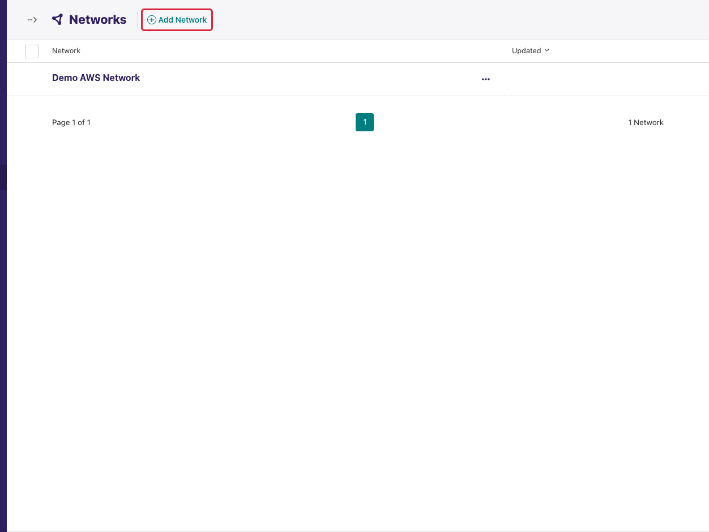
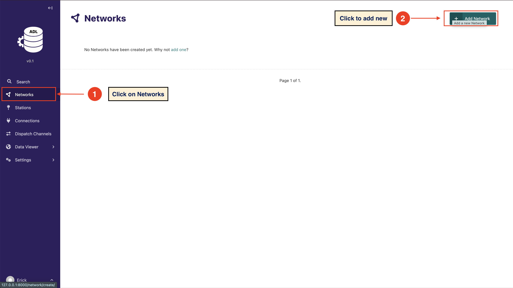
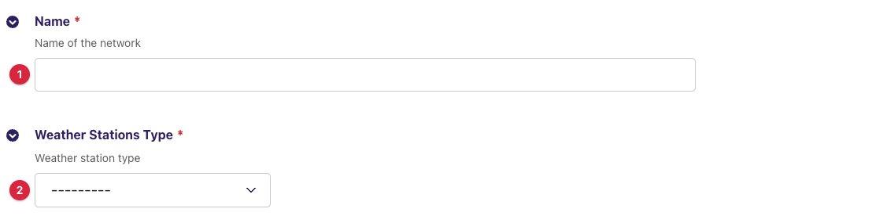

(manage-networks)=

# Manage Networks

A **network** is a named group of stations that share a vendor type or a
collection method — for example *National AWS Network*, *TAHMO Stations* or
*Manual Synoptic Stations*. It is the first thing to create on a new
instance: stations belong to a network, and every
[connection](manage_connections.md) is attached to one.

A network holds no credentials and no collection logic of its own. It exists
to scope station lists in the admin and to group connections. Nothing about
a network decides *how* data is fetched — that is the connection's job.

## Choosing your networks

One network per **data source type** is the usual shape:

| Situation | Networks to create |
|---|---|
| All stations are one vendor's AWS uploading to one FTP server | One network, type *Automatic Weather Stations* |
| Two vendors (say Davis and Pulsonic), each with its own upstream | Two networks, one per vendor |
| AWS plus manual synoptic stations entered through the mobile collector | One *Automatic* network and one *Manual* network |

You can attach several connections to one network (for instance a live FTP
connection and a backfill database connection for the same vendor), and a
station can only belong to one network — so split by source, not by region.

## Fields

| Field | Required | Description |
|---|---|---|
| **Name** | yes | Display name of the network. Shown on station lists, connection forms and the dashboard. |
| **Weather Stations Type** | yes | *Automatic Weather Stations* or *Manual Weather Stations*. Informational: it labels the network in lists and on the dashboard and has no effect on collection. |

## Adding a network

1. Click **Networks** in the sidebar. The list shows every network with its
   creation date.

   

2. Click **Add Network** at the top right.

   

3. Enter the **Name**, choose the **Weather Stations Type**, and click
   **Save**.

   

The new network appears in the list and in the **Network** dropdown of the
station form and the connection form.

## Editing and deleting

Click a network's name to edit it. Renaming is safe at any time; the new name
shows everywhere immediately.

```{warning}
**Deleting a network deletes everything under it.** Stations in the network,
their observation records, every connection attached to the network and all
of those connections' station links are removed together. The admin asks for
confirmation but cannot undo it. Move stations to another network first if
you only want to retire the grouping.
```

The list also supports **bulk delete**: tick the checkbox on several rows
and use the action bar that appears. The same cascade applies to each.

## Next step

Add stations to the network — manually or from WMO OSCAR Surface — in
[Manage Stations](manage_stations.md).
