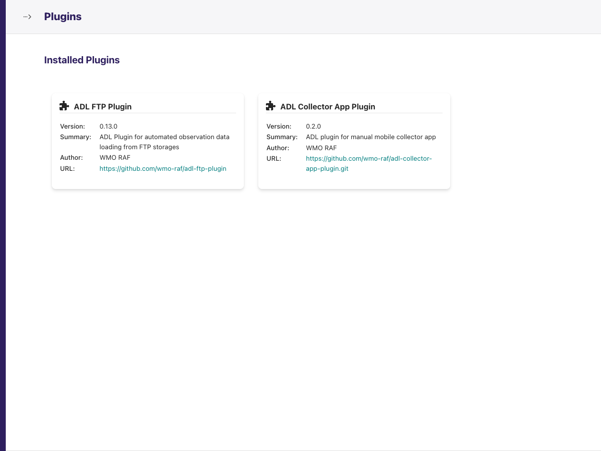

(manage-plugins)=

# Manage Plugins

A **plugin** is the installable package that knows how to talk to one kind
of data source (an FTP server with a vendor's file format, a vendor's REST
API, a database) or one kind of destination (WIS2Box, an S3 bucket). The ADL
core provides the stations, parameters, storage, scheduling, monitoring and
dispatch machinery; plugins provide the source-specific and
destination-specific parts.

For an operator, "managing plugins" means three things: knowing what is
installed, installing the plugin your data source needs, and configuring it
through the connection and station-link forms it adds to the admin.

## Seeing what is installed

The home page shows a **Plugins** counter. Click it to open the **Installed
Plugins** page at `/plugins/`. There is no sidebar entry; this counter is the
way in.



Each installed plugin is a card with:

| Field | Meaning |
|---|---|
| **Title** | The plugin's display label — the same name you will see in the *Plugin* dropdown when adding a connection. |
| **Version** | The installed package version. Compare it with the plugin's GitHub Releases page when checking for updates. |
| **Summary** | One-line description from the package. |
| **Author** | Package author. |
| **URL** | The plugin's home page or repository. |

The same information is available on the server:

```bash
docker compose exec adl list-plugins
```

A plugin that is installed but does not appear here failed to load. Check
the application logs (`make app-logs`) for the import error, which usually
names a missing dependency or an incompatible ADL core version.

## Finding and installing a plugin

[Available Plugins](../plugins/index.md) lists every plugin maintained for
ADL, what it connects to, and which to choose for common data sources.

Plugins are installed on the server, not from the admin. Three methods
exist — a `plugins.toml` manifest baked into the image (recommended for
production), the `ADL_PLUGIN_GIT_REPOS` environment variable, or the
`install-plugin` command inside a running container. They are described
step by step in [Plugin Installation](../developer_guide/plugins/plugin_installation.md).

In short, for production:

1. Add an entry to `plugins.toml` pinned to a release tag:

   ```toml
   [[plugins]]
   name = "ADL FTP Plugin"
   git  = "https://github.com/wmo-raf/adl-ftp-plugin.git"
   tag  = "0.13.0"
   ```

2. Rebuild and restart:

   ```bash
   make build && make up
   ```

3. Confirm the plugin appears on the **Installed Plugins** page.

```{note}
Plugin releases are tagged **without** a leading `v` (`0.13.0`, not
`v0.13.0`). The manifest pins the tag verbatim, so copy it exactly from the
plugin's Releases page.
```

## Configuring a plugin

Once installed, a plugin shows up in the admin as new **connection types**
and **station link types**. Configuring it is the sequence below; each
step's page has its own guide.

### 1. Create a connection

Go to **Connections → Add Connection**. The first screen lists every
installed plugin's connection type; pick the one for your source.


The form that follows has two parts:

- **Core fields**, identical for every plugin — name, network, whether the
  plugin runs automatically, the processing interval, batch and timeout
  settings. See [Manage Connections](manage_connections.md).
- **Plugin fields** — host, port, credentials, paths, API keys: whatever that
  source needs. Every plugin's guide documents these one by one.


### 2. Map the source's variables to ADL parameters

The plugin has to know that the source's `TA` column, or measure id `105`, or
key `rh`, is ADL's *Air Temperature* or *Relative Humidity*, and in which
unit the source sends it. This is done with **variable mappings**. Plugins
keep them in one of three places, and the plugin's guide says which:

| Where the mappings live | When plugins use it | Where you edit them |
|---|---|---|
| **On the connection** | The source uses the same variable codes for every station (most REST APIs). | A *Variable Mappings* link on the connection's row, or an inline list on the connection form. |
| **On each station link** | Variable codes differ per station, or stations need bespoke mappings. | The *Variable Mappings* section of the station link form. |
| **Both** (connection default, station override) | A network-wide default with occasional per-station exceptions (the FTP plugin). | Either; a station-level row for a parameter overrides the connection's row for that parameter. |

A mapping row is always the same three things: the **ADL parameter**, the
**source variable identifier**, and the **source unit** — the unit the
source actually delivers, which ADL converts from. See
[Manage Data Parameters](manage_data_parameters.md) for the parameter side.

### 3. Link stations

For each station to collect, add a **station link** under the plugin's
station link type (for example *FTP Station Links*). A link binds one ADL
station to the connection and carries the source-side station identifier
plus the *Collection Start Date*. See
{ref}`Station links: choosing where collection starts <station-links-choosing-where-collection-starts>`.

### 4. Verify

Open the connection's **Ingestion Diagnostic** from the *Health* column of
the connections list, press **Probe source now** to confirm credentials and
reachability, then **Run ingestion now** and watch the first run land. Each
station link's **Inspect** page shows what was fetched. The screens, buttons
and every message they can show are documented in
[Monitoring & Diagnostics](monitoring_and_diagnostics.md).

## Plugin-added pages

Some plugins add their own admin pages beyond the forms — a metadata
explorer that lists the source's stations and variables, a file browser for
an FTP folder, a decoder preview. They appear as extra links on the
connection's or station link's row menu and mount under the plugin's own URL
prefix. Each plugin's guide walks through the pages it adds; a plugin that
adds none says so.

## Updating or removing a plugin

- **Update** — change the `tag` in `plugins.toml`, rebuild, restart. Run
  `make migrate` if the release notes mention migrations. Check the plugin's
  *Compatibility* table for the ADL core version it needs.
- **Remove** — see *Uninstalling a plugin* in
  [Plugin Installation](../developer_guide/plugins/plugin_installation.md).
  Delete the plugin's connections first: a connection whose plugin is no
  longer installed cannot be opened or run.
