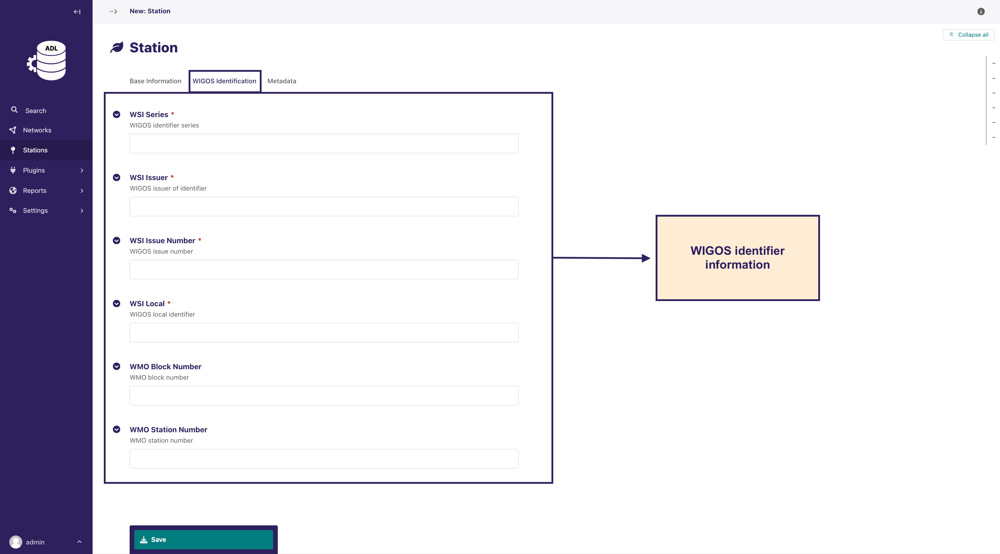
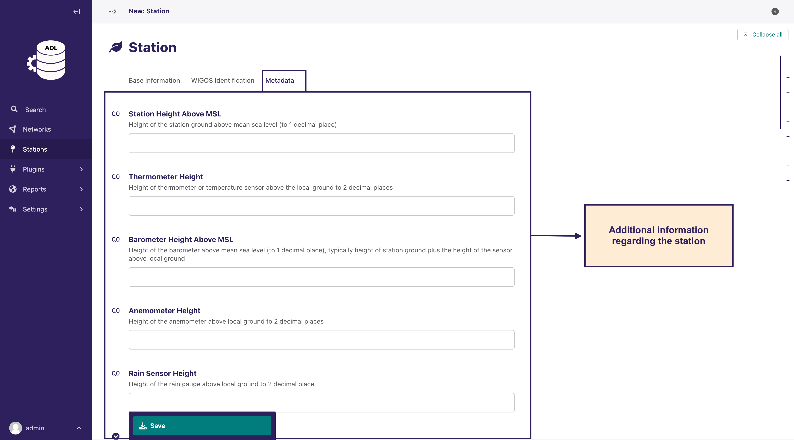
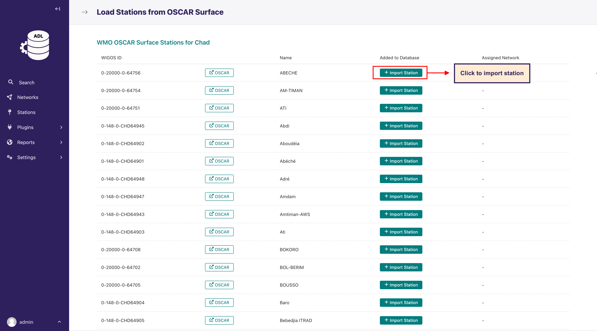
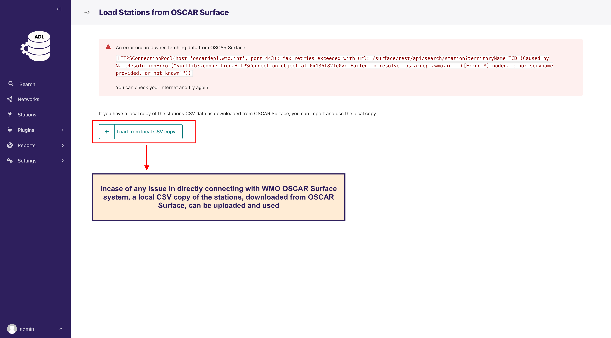
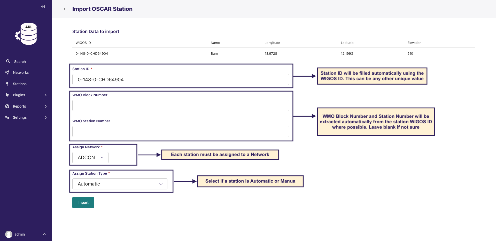

# Manage Stations

After creating a network, you can add stations to the network. Stations are the actual AWS stations or manual stations.

There are two ways to add stations to a network as shown in the image above:

## Manual Entry

You can manually add stations to a network by clicking on the `Stations` link on the left sidebar
and then clicking on the `Add Station` button.

You will be required to fill in the station details, WIGOS information, and station metadata.

**Station Base Info**

**Station WIGOS Info**

**Station Metadata**

## Importing from WMO OSCAR Surface

The quickest way to load stations is by importing from the [WMO OSCAR Surface](https://oscar.wmo.int/surface/#/)
database.

You can do so by clicking on the `Stations` link on the left sidebar and then clicking on
the `Load Stations from OSCAR Surface` button.

This will load stations from the OSCAR Surface database, and you can select the stations to add to the network.

### Using a local CSV Copy of stations data downloaded from OSCAR Surface

If you face network issues when connecting to the WMO OSCAR Surface API, you can import a pre-downloaded CSV file of
stations data for your country. The data should be downloaded from the
official [WMO OSCAR Surface](https://oscar.wmo.int/surface) website.

This will open a form where you can upload the CSV file. The CSV file should be in the structure as downloaded from WMO
OSCAR Surface.

If the CSV file is successfully uploaded, you will be redirected to a page where you can select the stations to import.

Irrespective of the method used to load stations from OSCAR Surface database, the importing process of the loaded
stations into the system will be the same.

After clicking on the `Import Station` button, a form with the station to import will be displayed. Here you will be
required to set the `Staton ID` and assign the station to a network and select if the station is an AWS station or
manual.

Then click on the `Import` button to import the station.