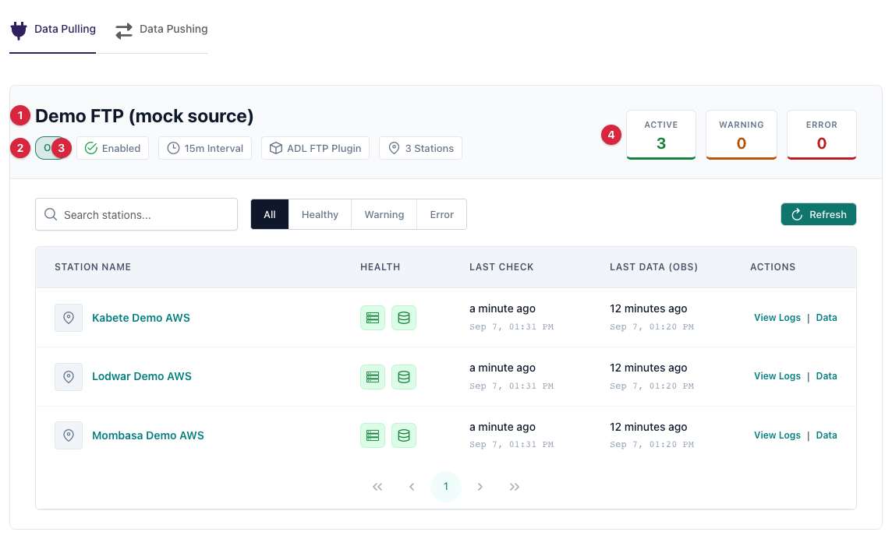
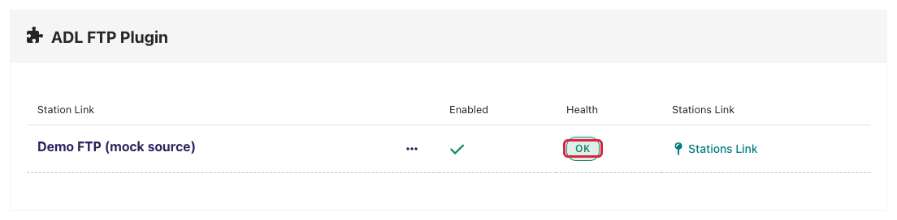
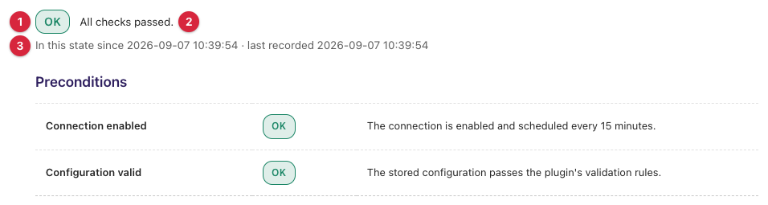
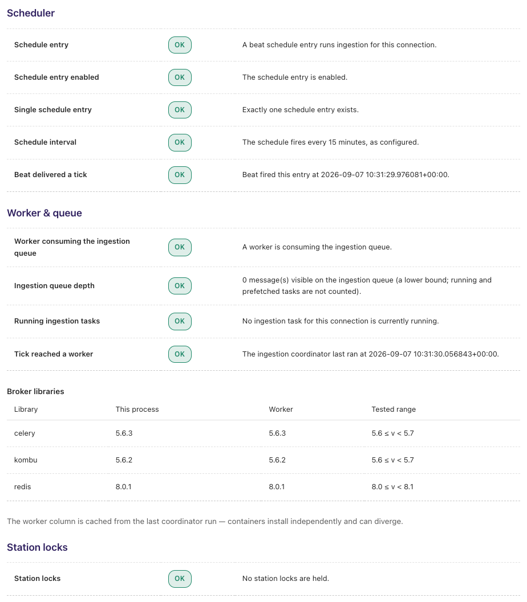
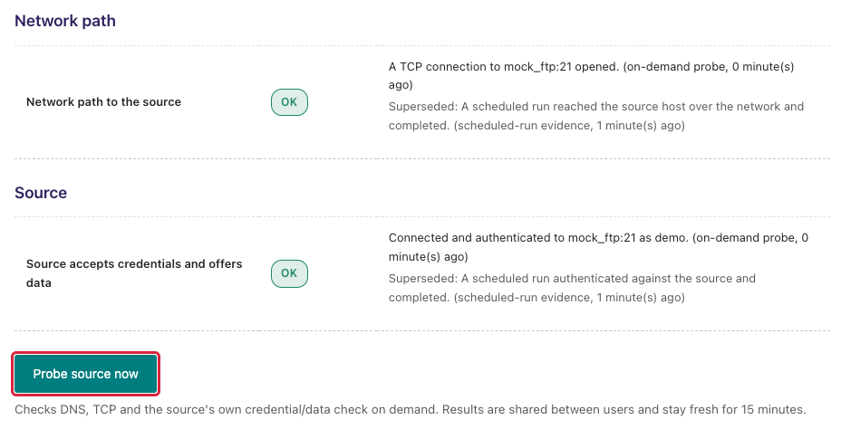
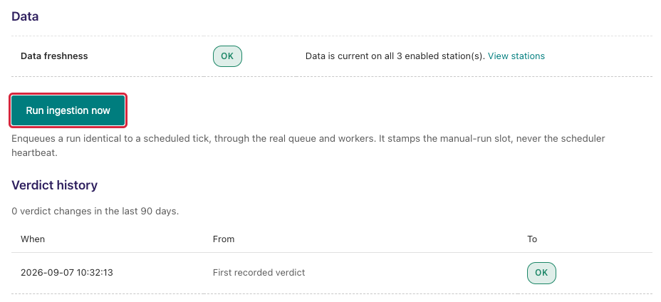
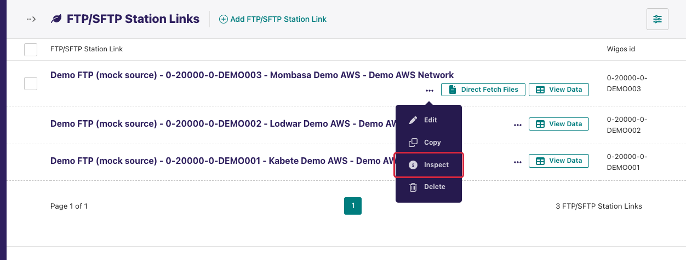
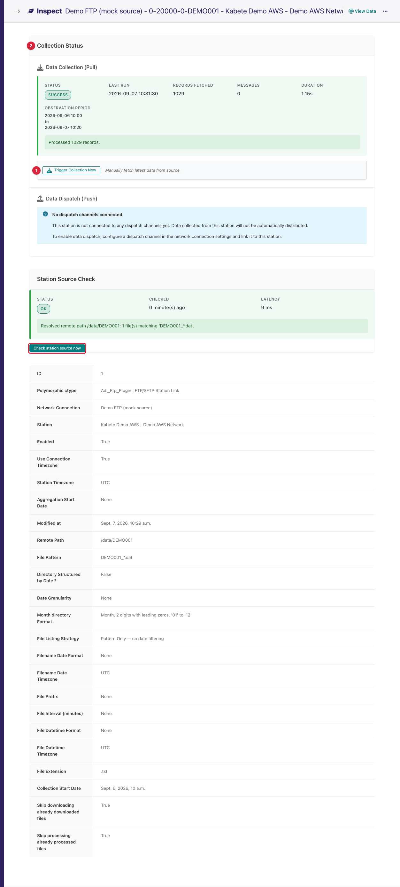

(monitoring-and-diagnostics)=

# Monitoring & Diagnostics

This page is for the moment a connection goes quiet: stations that were
reporting have stopped, or a new connection has never produced data, and you
need to find out *which part of the pipeline* failed — the scheduler, the
worker, the network path to the source, the source itself, or the data — and
what to do about it.

ADL answers that question on three screens, all rendered by the ADL core
regardless of which plugin the connection uses:

| Screen | Where | Question it answers |
|---|---|---|
| **Activity dashboard** | Admin home page, *Data Pulling* / *Data Pushing* tabs | Which connections and stations are healthy, warning, or in error right now? |
| **Ingestion Diagnostic** | `/monitoring/connection/<id>/health/` — from the *Health* column of the connections list | For one connection: what is the **first failing layer**, and what evidence says so? |
| **Station link Inspect page** | `/<plugin>stationlink/inspect/<id>/` — from the station links list | For one station: what did its last collection do, and does the source know this station? |

Plugin guides link here for the screens; what the *messages* on those
screens mean is split between this page (messages written by the ADL core)
and each plugin's own guide (messages written by that plugin's source check).
See [Feedback catalogue — messages produced by ADL core](#feedback-catalogue-core)
below.

```{note}
Everything on these screens is **read-only diagnosis** plus a few explicit
buttons. Opening a page never dials the source, never changes a verdict and
never restarts anything. Only the buttons named below take action, and each
one says what it will do before you press it.
```

(monitoring-where-to-look)=

## Where to look first

Work down this list; most problems are located by the second row.

1. **Home page dashboard** — is the whole connection red, or one station? A
   single red station on a green connection is a station-level problem
   (open its [Inspect page](#station-link-inspect-page)); a red connection
   badge is a pipeline problem (open its
   [Ingestion Diagnostic](#ingestion-diagnostic-page)).
2. **Ingestion Diagnostic headline** — read the status badge and the layer
   name beside it. That layer is where to look; every layer below it was not
   evaluated.
3. **Probe source now** — when the headline names *Network path* or *Source*,
   or those layers show **Stale**, press this once to get a fresh answer from
   the source itself.
4. **Station Source Check** — when the connection is healthy but one station
   collects nothing, run the station-scope check from its Inspect page.
5. **Run ingestion now** — after fixing a credential or a path, press this
   to prove the fix end to end without waiting for the next scheduled tick.

For dispatch problems (data collected but nothing arriving downstream), use
[Dispatch Troubleshooting](dispatch_troubleshooting.md) instead.

(monitoring-dashboard)=

## The activity dashboard

The admin **home page** carries an activity panel with two tabs: **Data
Pulling** (one card per network connection) and **Data Pushing** (one card
per dispatch channel). This is the fleet-wide view.


<!-- screenshot: manifest entry user/monitoring/dashboard_data_pulling -->

Each connection card shows, left to right in the header:

1. **Connection name.**
2. **Health badge** — the connection's stored diagnostic verdict, written as
   `STATUS · Layer` (for example `FAILED · Source`) or `No verdict yet`
   before the first evaluation has run. Hovering shows how long it has been in
   that state. **Clicking it opens the Ingestion Diagnostic page.**
3. **Enabled**, the **processing interval** in minutes, the **plugin** name
   and the **station count**.
4. Three counters — **Active**, **Warning**, **Error** — summarising the
   stations below.

Below the header is a searchable, filterable table of the connection's
stations (filters: *All*, *Healthy*, *Warning*, *Error*):

| Column | What it shows |
|---|---|
| **Station Name** | Links to the station's activity timeline page. |
| **Health** | Two indicators. The first is the **pipeline** status — did the scheduled collection run recently and succeed? The second is **data freshness** — how old is the newest observation? Hover each for its name. |
| **Last Check** | When the collection task last ran for this station, or *Never*. Shown in red when the pipeline status is error (the last run failed). |
| **Last Data (Obs)** | Timestamp of the newest stored observation, or *Never*. Red when the data is stale. |
| **Actions** | Shortcuts to the station's activity log and data. |

(monitoring-station-colours)=

### How station colours are decided

The two indicators are computed from the connection's **processing
interval**, so a 5-minute connection and a daily one are judged fairly:

| Signal | Active (green) | Warning (amber) | Error (red) |
|---|---|---|---|
| **Pipeline** | Last run succeeded within 3 × interval | Last run succeeded, but more than 3 × interval ago; or never run | Last run **failed** |
| **Data freshness** (interval-based connection) | Newest observation younger than 4 × interval | Younger than 12 × interval | Older than 12 × interval, or no data at all |
| **Data freshness** (daily-data connection) | Younger than 26 hours | Younger than 48 hours | Older than 48 hours |

A station's overall colour is the worse of the two. The same rules feed the
**Data** layer of the Ingestion Diagnostic, so the dashboard and the
diagnostic never disagree about a station.

(monitoring-health-column)=

## The Health column on the connections list

Open **Network Connections** from the admin menu. Each connection row
carries a **Health** column with the same stored verdict badge as the
dashboard. Hover it for the headline message; click it to open the
connection's Ingestion Diagnostic.


<!-- screenshot: manifest entry user/monitoring/connections_list_health_column -->

`No verdict yet` (grey) means the periodic evaluation has not run since the
connection was created. It runs every five minutes; the badge fills in on its
own.

(ingestion-diagnostic-page)=

## The Ingestion Diagnostic page

**URL:** `/monitoring/connection/<id>/health/`
**Reach it from:** the *Health* column of the connections list, or the
health badge on a dashboard card.

The page is titled **Ingestion Diagnostic — `<connection name>`** and answers
one question: *what is the first thing that failed?* It is computed fresh
every time you open it, from records ADL already holds (heartbeats, the beat
schedule, held locks, activity logs, stored probe results). Opening the page
performs no network calls to the source.


<!-- screenshot: manifest entry user/monitoring/ingestion_diagnostic_headline -->

### The headline

The top line has three parts:

1. A **status badge** — one of the states in the table below.
2. The **first failing layer**, in bold, when there is one (for example
   **Scheduler**). Everything below that layer in the ladder was not
   evaluated.
3. The **headline message** — the message of the check that set the verdict,
   or *All checks passed.*

Under it: *In this state since `<date>` · last recorded `<date>`*. **Since** moves
only when the verdict changes, so a long-standing failure shows how long it
has been failing. **Last recorded** is when the periodic evaluation last ran.
Before the first evaluation the line reads *No verdict recorded yet — the
periodic sweep has not run since this connection was created.*

If the most recent ingestion run was started with **Run ingestion now**, a
caption says so: *The most recent ingestion run was triggered manually at
`<time>` — it is not evidence that the schedule is working.* A manual run
proves the workers, not the scheduler; the scheduler layer is judged only on
scheduled ticks.

### The states

Only three states are verdicts about severity and are coloured. The rest are
grey and say what the diagnostic *could not observe*; read their wording.

| State | Colour | Meaning |
|---|---|---|
| **OK** | green | The check passed. |
| **Warning** | amber | Something is off but not yet fatal (schedule drift, a slow task, some stale stations). |
| **Failed** | red | The check failed. The first *blocking* failure becomes the headline. |
| **Skipped** | grey | Not evaluated, because a failure above it makes the check meaningless. Not a failure. |
| **Stale** | grey | The layer is probed on demand only and no fresh evidence exists. Press **Probe source now**. |
| **Unsupported** | grey | The plugin does not implement this check, or the installed broker libraries are outside the tested range, so the diagnostic cannot say. |
| **Not applicable** | grey | The layer has no subject for this connection (observations are submitted to ADL directly, so there is no external source to reach). |
| **Disabled** | grey | Ingestion for the connection is switched off. |
| **Misconfigured** | grey | The stored configuration no longer passes the plugin's own validation rules. Fix the named field on the connection's edit form. |

### The ladder

After the **Preconditions** band, checks are grouped into six layers in the
order a failure propagates. Failures short-circuit: once a blocking check
fails, every check below it reports **Skipped**, so the diagnostic never
claims to know something it could not have observed.

| # | Layer heading | What it verifies | Evidence comes from |
|---|---|---|---|
| — | **Preconditions** | The connection is enabled; its stored configuration still passes validation. | The connection row itself. |
| 1 | **Scheduler** | A beat schedule entry exists, is enabled, is unique, fires at the configured interval, and has actually fired recently. | The `django-celery-beat` schedule table. |
| 2 | **Worker & queue** | A worker is consuming the ingestion queue; queue depth; running tasks for this connection and whether one is stuck; and whether beat's ticks reached a worker (the coordinator heartbeat). | One bounded query to the message broker. |
| 3 | **Station locks** | Per-station locks held by dead workers. | The cache plus the broker's running-task list. |
| 4 | **Network path** | DNS resolution and a TCP connection to the source host and port. | An on-demand probe, or a recent scheduled run. |
| 5 | **Source** | The source accepts the configured credentials and offers data. | An on-demand probe (the plugin's own source check), a recent scheduled run, or the classification of a recent failed run. |
| 6 | **Data** | Whether enabled stations have fresh observations, rolled up per station. | Stored observations, judged with the [dashboard thresholds](#monitoring-station-colours). |

Two rules to keep in mind when reading:

- **Advisory findings never lead.** Schedule drift, an unanswering broker,
  queue depth and a slow-but-not-stuck task are shown as warnings but do not
  set the headline.
- **Layers 4 and 5 rest at Stale, never Failed.** ADL does not probe partner
  hosts on a timer (across 26 deployments that risks IP bans). These layers go
  red only from an on-demand probe you pressed or from a scheduled run that
  actually failed against the source — and they go green again from the next
  successful scheduled run, so a fix shows up without a probe.

#### Layers 1–3: Scheduler, Worker & queue, Station locks


<!-- screenshot: manifest entry user/monitoring/ingestion_diagnostic_internal_layers -->

These layers are about ADL's own machinery and need no plugin support. The
fixes are almost always one of: **re-save the connection** (recreates or
repairs its schedule entry), **restart the beat scheduler**, or **restart the
ingestion worker**. The message on each row names which.

Under the Worker & queue table is a **Broker libraries** table listing the
`celery`, `kombu` and `redis` versions in *this process* (the web container)
and in the *worker* (cached from its last coordinator run), against the
tested range. It renders always. When a version is outside the tested range,
the affected checks show **Unsupported** rather than guessing — see the
catalogue.

(monitoring-external-evidence)=

#### Layers 4–5: Network path and Source, and the probe button


<!-- screenshot: manifest entry user/monitoring/ingestion_diagnostic_external_layers -->

Each of these layers holds **one line of evidence**, ending with its origin
and age in the form `(<origin>, N minute(s) ago)`. The origin is one of:

| Origin text | Meaning |
|---|---|
| `on-demand probe` | Someone pressed **Probe source now** within the last 15 minutes. |
| `scheduled-run evidence` | A scheduled ingestion run within the last 2 × interval reached (layer 4) or authenticated against (layer 5) the source; or a failed run whose error ADL classified at the time it was recorded. |
| `classified from the run log` | A failed run whose error text ADL matched to a known failure pattern afterwards. |

When two observations disagree, the freshest wins and the displaced one is
kept beneath it as *Superseded: …* — so a probe that failed five minutes ago
and a scheduled run that succeeded two minutes ago both stay visible.

The **Probe source now** button sits under the Source table and covers both
layers. It is shown only to users who may change the connection, and only
when the plugin supports the source-check contract. Pressing it:

1. Resolves the source host name (**DNS**), then opens a **TCP** connection
   to the host and port, then runs the plugin's own **source check** (a
   read-only "do you accept our credentials and offer data?" call). Each
   step runs only if the previous one passed.
2. Runs synchronously in the web process under a hard **15-second** budget,
   so a hung source cannot wedge the page.
3. Stores the steps as probe results and shows the outcome as a banner at
   the top of the page (the first failing step's message, or *Source probe
   completed: N check(s) passed.*).
4. Refreshes both layers with `on-demand probe` evidence, valid for **15
   minutes**.

One probe per source host per **minute**, shared between all users and all
connections to that host. A press inside the cooldown does not error: it
shows the stored result with its age, or says a probe is in flight.

#### Layer 6: Data, and the run button


<!-- screenshot: manifest entry user/monitoring/ingestion_diagnostic_data_and_history -->

The Data row rolls up every enabled station link: all stale → **Failed**,
some stale → **Warning**, none → **OK**. It carries a **View stations** link
to the connection's monitoring page where each station is listed.

The **Run ingestion now** button closes the ladder. It enqueues a run that
is *identical* to a scheduled tick — same queue, same workers, same
per-station settings — so a successful run proves the workers are alive and,
for a dialling plugin, becomes fresh scheduled-run evidence for layers 4 and
5. It is hidden when the connection is disabled, when no worker is consuming
the ingestion queue (the press would achieve nothing), or when you lack the
change permission.

The manual run stamps a separate *manual-run* slot, never the scheduler
heartbeat — which is why the headline caption above appears afterwards. One
press per connection per processing interval, capped at 15 minutes, and a
press while a run is already executing reports the running run instead of
queueing a duplicate.

### Verdict history

The bottom of the page lists every change of verdict for the last **90
days**, newest first, with the from-and-to status and layer, and a count:
*N verdict changes in the last 90 days.* A high count on a connection that is
currently green is a **flapping** source — intermittent network or an
overloaded partner — and worth raising with the source's operator even though
nothing is red right now.

(station-link-inspect-page)=

## The station link Inspect page

**URL:** `/<plugin>stationlink/inspect/<id>/` (for example
`/ftpstationlink/inspect/12/`).
**Reach it from:** the plugin's station links list — open the row's **…**
menu and choose **Inspect**.


<!-- screenshot: manifest entry user/monitoring/station_link_list_inspect_menu -->

The Inspect page shows two status panels above the station link's stored
fields.


<!-- screenshot: manifest entry user/monitoring/station_link_inspect_page -->

### Collection Status panel

**Data Collection (Pull)** summarises the most recent collection run for
this station:

| Field | Meaning |
|---|---|
| **Status** | *Success* or *Failed* for the last run. |
| **Last Run** | When it ran. |
| **Records Fetched** | How many observation records the run saved. Zero on a successful run means the source offered nothing for the window. |
| **Messages** | The run's own summary line. |
| **Duration** | Wall-clock time of the run. |
| **Observation Period** | The time window the run asked the source for. |
| **Error** | The failure text of a failed run, with any credentials removed. |

*No collection activity recorded yet* means the station has never been
processed — either the connection has not ticked since the link was created,
or the link is disabled.

**Trigger Collection Now** enqueues an immediate collection for **this
station only**, through the real ingestion queue. Use it after changing the
station's source identifier or start date. The banner *Data collection
triggered for station link: `<name>`* confirms the task was queued; the
outcome appears in this panel on the next page load. The button is shown
only to users who may change the connection.

**Data Dispatch (Push)** lists each dispatch channel this station is linked
to, with the same fields for the last push and a **Trigger Dispatch Now**
button per channel. *No dispatch channels connected* means collected data
is stored but not forwarded anywhere — see
[Manage Dispatch Channels](manage_dispatch_channels.md).

### Station Source Check panel

Where the connection-level probe asks "does the source accept us at all?",
this panel asks "**does the source know this particular station?**" — the
question behind the most common support case: connection green, one station
empty.

The card shows the latest stored result for this station: a **Status**
badge (OK or FAILED), **Checked** (age in minutes), **Latency** in
milliseconds, and the message. Before the first check it reads *This
station's source configuration has not been checked yet.*

**Check station source now** runs the plugin's station-scope check for this
one station — one connect-and-verify cycle, no fan-out to other stations —
under the same 15-second budget, and shows the result as a banner. One check
per station per minute; a press inside the cooldown returns the stored
result. The button is hidden when the plugin does not implement the
station-scope check or you lack the change permission.

The message text is written by the plugin. Typical OK messages name the
station as the source knows it (for example *Station 1234 found upstream as
"BAMAKO-SENOU"*); typical failures say the identifier was not found or the
list could not be read. **Match the message to the feedback catalogue in the
plugin's own guide.**

```{note}
A station-scope result belongs to that station only. It never changes the
connection's verdict on the Ingestion Diagnostic, and the connection's probe
never appears here.
```

**Configuration drift.** If the station link's stored fields no longer pass
the plugin's validation rules (for instance a start date that is now in the
future, or a path format the plugin has since tightened), an amber notice
appears above the card listing the failing fields. Ingestion is not stopped,
but this station's runs are excluded from the connection's Source-layer
evidence until you fix the named fields on the station link's edit form.

(monitoring-activity-pages)=

## Activity timelines

Two further pages show *history* rather than a verdict:

- **Connection monitoring** — `/monitoring/connection/<id>/`, reached from
  the diagnostic's **View stations** link. A per-station timeline of pull
  runs (successful with data, successful without data, failed, skipped),
  with the connection's enabled state, interval and linked-station count in
  the header.
- **Station link monitoring** — `/monitoring/station-link/<id>/`, reached
  from a station name on the dashboard. The same timeline for one station,
  with a **View Data** button to the stored observations, and the same
  configuration-drift notice as the Inspect page when it applies.

Run rows on these timelines are the *activity logs* the diagnostic reads as
evidence. They are kept for **7 days**.

(feedback-catalogue-core)=

## Feedback catalogue — messages produced by ADL core

Every message below is written by the ADL core and can appear on the screens
above for **any** plugin. Find the one on your screen. Angle brackets mark
values filled in at runtime; example numbers are illustrative.

Messages *not* in this catalogue — the text after `Probe source now`
completes its source step, and everything in the Station Source Check card —
are written by the plugin's source check. Look them up in the plugin's guide.

### Headline and preconditions

| Message | Status | Meaning | What to do |
|---|---|---|---|
| `All checks passed.` | OK | Every blocking check is OK. | Nothing. |
| `This connection is disabled.` / `Ingestion for this connection is switched off. Nothing below is evaluated.` | Disabled | *Active* is unchecked on the connection. | Edit the connection and tick **Active** if it should be collecting. |
| `The connection is enabled and scheduled every <N> minutes.` | OK | Precondition passed. | Nothing. |
| `The stored configuration is no longer valid — check field(s): <field, field>.` | Misconfigured | The connection's saved fields fail the plugin's own validation. Ingestion still runs, but the diagnostic stops here. | Open the connection's edit form and fix the named fields. The row below lists each field's message. |
| `The stored configuration no longer passes validation — <field>: <message>; … Fix the named field(s) on the connection's edit form. …` | Misconfigured | Detail for the row above. | As above. |
| `The stored configuration passes the plugin's validation rules.` | OK | Precondition passed. | Nothing. |
| `This plugin declares no connection-level configuration rules of its own, so only core's field validation ran — silence is not validation.` | Unsupported (advisory) | The plugin has no custom validation; nothing was checked beyond field types. | Nothing; informational. |
| `The plugin's validation rules crashed, so configuration drift could not be evaluated. This is not evidence the configuration is wrong; see the application logs.` | Unsupported (advisory) | A bug in the plugin's validator. | Report it to the plugin maintainer with the application log traceback. |
| `Not evaluated — the stored configuration is invalid.` / `Not evaluated — the connection is disabled.` / `Not evaluated — a failure above makes this check meaningless.` | Skipped | This row was not run. | Fix the failure above. |
| `No verdict recorded yet — the periodic sweep has not run since this connection was created.` | — | The five-minute evaluation has not run yet. | Wait up to five minutes. If it never appears, the worker running housekeeping tasks is down — see [Restarting services](#monitoring-restarts). |
| `The most recent ingestion run was triggered manually at <time> — it is not evidence that the schedule is working.` | — | The last run came from **Run ingestion now**. | Wait one interval and re-check the Scheduler layer. |

### Layer 1 — Scheduler

| Message | Status | Meaning | What to do |
|---|---|---|---|
| `A beat schedule entry runs ingestion for this connection.` | OK | | Nothing. |
| `No beat schedule entry runs ingestion for this connection. Re-saving the connection recreates it.` | Failed | The periodic task row is missing. | Open the connection's edit form and click **Save** without changes. |
| `The schedule entry is enabled.` | OK | | Nothing. |
| `The schedule entry is disabled while the connection is enabled, so beat never fires it. Re-saving the connection re-enables it.` | Failed | The periodic task was disabled by hand. | Re-save the connection. |
| `Exactly one schedule entry exists.` | OK | | Nothing. |
| `<N> schedule entries run this connection; which one beat fires is undefined. Re-saving the connection collapses them back to one.` | Warning (advisory) | Duplicate periodic task rows. | Re-save the connection. |
| `The schedule fires every <N> minutes, as configured.` | OK | | Nothing. |
| `The schedule entry does not fire every <N> minutes as the connection is configured to. Re-saving the connection corrects it.` | Warning (advisory) | The periodic task's interval no longer matches the connection. | Re-save the connection. |
| `Beat fired this entry at <time>.` | OK | | Nothing. |
| `Beat has never fired this schedule entry. The beat scheduler is not running, or was never started.` | Failed | The `adl_celery_beat` service is down, or has been down since the connection was created. | Restart the beat scheduler. |
| `Beat last fired this entry at <time> — more than twice the <N>-minute interval ago. The beat scheduler has stopped.` | Failed | Beat was running and stopped. | Restart the beat scheduler. |

### Layer 2 — Worker & queue

| Message | Status | Meaning | What to do |
|---|---|---|---|
| `A worker is consuming the ingestion queue.` | OK | | Nothing. |
| `Workers replied, but none is consuming the ingestion queue. The ingestion worker is down or misrouted.` | Failed | The worker fleet answered but nobody is subscribed to the ingestion queue. **Run ingestion now** is hidden in this state. | Restart the ingestion worker. If it keeps happening, check the worker's queue configuration. |
| `The broker did not answer, so whether a worker is consuming the ingestion queue is unknown.` | Warning (advisory) | Redis did not respond within the bound. Unknown, not down. | Check that Redis is up and reachable from the web container. |
| `<N> message(s) visible on the ingestion queue (a lower bound; running and prefetched tasks are not counted).` | OK (advisory) | Queue depth. A steadily growing number means workers are not keeping up. | Nothing unless it grows; then add worker capacity or lengthen intervals. |
| `The broker did not answer, so the ingestion queue depth is unknown.` | Warning (advisory) | As above for depth. | Check Redis. |
| `No ingestion task for this connection is currently running.` | OK | | Nothing. |
| `<N> ingestion task(s) for this connection are running within their time budget.` | OK | A run is in progress and not overdue. | Nothing. |
| `An ingestion task for this connection has been running for <M> minutes — longer than the connection's own <N>-minute interval.` | Warning (advisory) | Slow, not yet stuck. | Watch it; if the source is slow, consider a longer interval or a smaller batch. |
| `An ingestion task for this connection has been running for <M> minutes — more than three times the connection's interval. It is stuck, not slow.` | Failed | A hung task. | Restart the ingestion worker. Then check the source for a hung connection (the probe helps). |
| `The broker did not answer, so running ingestion tasks are unknown.` | Warning (advisory) | | Check Redis. |
| `The ingestion coordinator last ran at <time>.` | OK | Beat's ticks are reaching a worker. | Nothing. |
| `Beat is delivering ticks, but the ingestion coordinator has never run — the ticks are not reaching a worker.` | Failed | Beat fires, nothing consumes. | Restart the ingestion worker; check that it listens on the ingestion queue. |
| `Beat is delivering ticks, but the ingestion coordinator last ran at <time> — the ticks have stopped reaching a worker.` | Failed | As above, after previously working. | Restart the ingestion worker. |
| `Not evaluated — this is not the tested broker stack: <library> <version> is outside the tested range <range>. The signal cannot vouch for a value measured against a different stack; see the pinned versions in requirements.txt.` | Unsupported | An installed `celery`, `kombu` or `redis` version is outside the range ADL was tested with, so this signal is not trusted. Shown with the Broker libraries table. | Rebuild the image from the pinned requirements. This is informational; ingestion is not affected by the diagnostic declining. |
| `Not evaluated — the underlying library API is not the tested one: <description>. A library outside the pinned set is likely installed; see requirements.txt.` | Unsupported | The broker library's API changed shape. | As above. |

### Layer 3 — Station locks

| Message | Status | Meaning | What to do |
|---|---|---|---|
| `No station locks are held.` | OK | | Nothing. |
| `<N> station lock(s) are held by running ingestion tasks.` | OK | Normal during a run. | Nothing. |
| `<N> station lock(s) are held, but the broker did not answer, so whether a task is behind them is unknown. Locks expire on their own TTL.` | Warning (advisory) | Cannot tell live from stale. | Check Redis; otherwise wait for expiry. |
| `<S> of <T> enabled stations hold stale locks with no task behind them — a worker died mid-run. They expire on their own TTL.` | Warning | Some stations were mid-collection when a worker died. Those stations show *Skipped — previous run still running* until the lock expires. | Wait; the locks expire on their own. Investigate why the worker died (memory, restart). |
| `All <T> enabled stations hold stale locks with no task behind them — a worker died mid-run. They expire on their own TTL.` | Failed | Every station is blocked by a dead worker's lock. | Wait for expiry, and investigate the worker crash. |

### Layers 4–5 — Network path and Source (evidence lines)

Each evidence line ends with `(<origin>, <N> minute(s) ago)`; the origins
are explained [above](#monitoring-external-evidence).

| Message | Status | Meaning | What to do |
|---|---|---|---|
| `A scheduled run reached the source host over the network and completed.` | OK (layer 4) | A real scheduled run got through. | Nothing. |
| `A scheduled run authenticated against the source and completed.` | OK (layer 5) | A real scheduled run logged in and transferred data. | Nothing. |
| `Runs within the data-freshness window found source data on offer — the fault is downstream of the source.` | OK (layer 5) | Data is stale (layer 6 red) but the source *did* offer items, so the source is not to blame. | Look at the Data layer and the station activity logs: the failure is in parsing, mapping, or saving. Check the run's *Error* on the station's Inspect page. |
| `Data is stale and every run within the data-freshness window resolved zero source items — the source is offering no data.` | Failed (layer 5) | ADL reached the source and it consistently had nothing for the requested window. | The stations are not sending to the source, or the window or path is wrong. Check the source side, and the station identifiers. |
| `The source host name did not resolve (DNS failure).` | Failed (layer 4) | | Check the host name on the connection and DNS on the ADL host. |
| `The source host refused a TCP connection.` | Failed (layer 4) | Host reachable, port closed. | Check the port on the connection; check the source service is running. |
| `A connection to the source timed out.` | Failed (4 or 5) | Firewall, or a source that accepts connections but never answers. | Check firewall rules from the ADL host; check the source's load. |
| `TLS negotiation with the source failed.` | Failed | Certificate or protocol mismatch. | Check the source's certificate and the TLS setting on the connection. |
| `The source rejected the configured credentials.` | Failed (layer 5) | Wrong username, password or token. | Re-enter the credential on the connection, then **Probe source now**. |
| `The source denied permission for the requested operation.` | Failed (layer 5) | Login accepted, action forbidden. | Ask the source's operator to grant the account read access to the path or resource. |
| `The configured remote path was not found on the source.` | Failed (layer 5) | The directory, endpoint or table does not exist. | Fix the path on the connection or station link. |
| `The source replied with an unexpected protocol response.` | Failed (layer 5) | The host answered, but not as the expected protocol (a proxy page, a wrong port). | Check the URL, port and any proxy between ADL and the source. |
| `The run failed with an unclassified connection error.` | Failed | A failure ADL could not categorise. | Open the failed run on the station's Inspect page for the full error text. |
| `Superseded: <evidence line>` | — | An older observation displaced by a fresher one. | Read both; the newer line is the verdict. |
| `Not recently checked — the last on-demand probe ran <N> minute(s) ago, outside the 15-minute freshness window.` | Stale | The resting state after a probe has aged out. | Press **Probe source now** if you need a fresh answer; otherwise the next successful scheduled run refreshes it. |
| `Not recently checked — no probe has run and no recent run left usable evidence. External layers are probed on demand only.` | Stale | Nothing to go on yet. | Press **Probe source now**. |
| `This plugin does not name its source endpoint, so core cannot probe the network path.` | Unsupported (layer 4) | The plugin has not implemented the endpoint contract. | Nothing you can do in the admin; the plugin's own error text on failed runs is your evidence. Ask the plugin maintainer. |
| `This plugin does not implement the source check.` | Unsupported (layer 5) | As above for the source check. | As above. |
| `The plugin returned a malformed result, which core does not trust: <detail>` | Unsupported | The plugin's check returned something ADL could not read. | Report to the plugin maintainer with the detail. |
| `Observations are submitted to ADL directly, so there is no external source to reach or authenticate against. This layer does not apply to this connection.` | Not applicable | The plugin is push-fed (for example a mobile app or webhook). | Nothing. Look at the Data layer: stale here means the submitters went quiet. |
| `This source delivers to ADL rather than being fetched, so ADL opens no network path to it and there is nothing here to probe. Whether the source itself is reporting is answered by the layer below.` | Not applicable (layer 4) | The source is a real machine (an ADL Agent, say) that pushes to ADL. | Read the Source layer for what the machine last reported. |

### Probe steps (banner after *Probe source now*, and layer-4 probe evidence)

| Message | Status | Meaning | What to do |
|---|---|---|---|
| `Source probe completed: <N> check(s) passed.` | OK | DNS, TCP and the plugin's check all passed. | Nothing. |
| `<host> resolved.` | OK | DNS step. | |
| `<host> did not resolve: <error>` | Failed | DNS failure. | Check the host name; check DNS from the ADL host. |
| `Resolving <host> did not complete within the probe's time budget.` | Failed | DNS server not answering. | Check the ADL host's DNS configuration. |
| `A TCP connection to <host>:<port> opened.` | OK | TCP step. | |
| `<host> refused a TCP connection on port <port>.` | Failed | Port closed or wrong. | Check the port; check the source service. |
| `A TCP connection to <host>:<port> timed out.` | Failed | Firewalled or silently dropped. | Open the port from the ADL host on any firewall in between. |
| `A TCP connection to <host>:<port> failed: <error>` | Failed | Another socket error (no route, network unreachable). | Read the error; check routing from the ADL host. |
| `The source check did not complete within the probe's 15-second budget.` | Failed | DNS and TCP passed, but the plugin's check hung. The source accepts connections and then stalls. | Check the source's load; try again in a minute. |
| `The source check raised <ExceptionType>: <error>` | Failed | The plugin's check crashed. | Report to the plugin maintainer with the message; the application log has the traceback. |
| `The probe ran, but the plugin did not return a usable result.` | Warning | The plugin returned an unsupported or malformed result. | Report to the plugin maintainer. |
| `The probe could not run to completion. See the application logs for the cause.` | Error | The probe machinery itself crashed. | Check the application logs. |
| `This plugin does not implement the source-check contract, so there is nothing to probe.` | Warning | You reached the probe URL for a plugin without support. | Nothing. |
| `Probed <N> minute(s) ago (on-demand probe): <message> — one probe per source host per minute; this shared result is the limit.` | Info | You pressed inside the one-minute cooldown. | Read the shown result; press again after a minute if needed. |
| `A probe for this source was started less than a minute ago and has not recorded a result yet. Refresh shortly, or try again in a minute.` | Info | Another user's probe (or your own) is in flight. | Refresh the page. |

### Layer 6 — Data

| Message | Status | Meaning | What to do |
|---|---|---|---|
| `This connection has no enabled station links.` | OK | Nothing to collect. | Link stations, or enable existing links. |
| `Data is current on all <T> enabled station(s).` | OK | | Nothing. |
| `No station has stale data, but <A> of <T> enabled station(s) have no fresh observations within the warning window.` | OK | Some stations are aging (amber on the dashboard) but none is past the error limit. | Watch them; check those stations at the source. |
| `<S> of <T> enabled stations have stale data — no recent observations within the connection's freshness limit.` | Warning | Some stations are red. The pipeline works for the others. | Open each red station's Inspect page and run **Check station source now**. |
| `All <T> enabled station(s) have stale data — no recent observations within the connection's freshness limit.` | Failed | Nothing is arriving, and every layer above is green. | Read the Source layer's sources-count evidence: if the source offered no data, the problem is upstream of ADL; if it did, check the run errors on a station's Inspect page. |

### *Run ingestion now* banners

| Message | Status | Meaning | What to do |
|---|---|---|---|
| `Ingestion run enqueued on the real queue — it runs exactly as a scheduled tick would. Results will appear in the activity log.` | Success | The run is queued. | Watch the dashboard or the station Inspect pages. |
| `Ingestion for this connection is disabled — enable it before running it.` | Warning | | Tick **Active** on the connection. |
| `An ingestion run for this connection is already running (started <N> minute(s) ago). Its outcome will appear in the activity log.` | Info | No duplicate was queued. | Wait for it to finish. |
| `A manual run was triggered <N> minute(s) ago. The cooldown is the connection's processing interval, capped at 15 minutes — check the activity log for that run's outcome.` | Info | Inside the cooldown. | Look at the outcome of the earlier run. |

### Station Inspect page banners (core-authored)

| Message | Status | Meaning | What to do |
|---|---|---|---|
| `Data collection triggered for station link: <name>` | Success | **Trigger Collection Now** queued a run for this station. | Reload the page after a moment. |
| `Failed to trigger collection: <error>` | Error | The task could not be queued — usually the broker is down. | Check Redis and the worker. |
| `This station's source configuration has not been checked yet.` | — | No station-scope check has run. | Press **Check station source now**. |
| `Checked <N> minute(s) ago (on-demand station check): <message> — one check per station per minute; this shared result is the limit.` | Info | Inside the cooldown. | Read the shown result. |
| `A check for this station was started less than a minute ago and has not recorded a result yet. Refresh shortly, or try again in a minute.` | Info | A check is in flight. | Refresh. |
| `The check ran, but the plugin did not return a usable result.` | Warning | Unsupported or malformed plugin result. | Report to the plugin maintainer. |
| `The station source check could not run to completion. See the application logs for the cause.` | Error | The check machinery crashed. | Check the application logs. |
| `This plugin does not implement the station source check, so there is nothing to run.` | Warning | The plugin has no station-scope check. | Use the connection-level probe and the run's error text instead. |
| `Configuration drift — this station link's stored configuration no longer passes validation. Fix the named field(s) on the station link's edit form. …` | Warning notice | Listed fields fail validation. | Fix them on the station link's edit form. |

(monitoring-restarts)=

## Restarting services

When a Scheduler or Worker & queue row tells you to restart something, on the
ADL host:

```bash
# beat scheduler ("Beat has never fired…", "The beat scheduler has stopped.")
docker compose restart adl_celery_beat

# ingestion worker ("none is consuming the ingestion queue", "ticks are not reaching a worker", stuck task)
docker compose restart adl_celery_worker_adl

# housekeeping worker ("No verdict recorded yet" that never fills in)
docker compose restart adl_celery_worker_default

# broker ("The broker did not answer…")
docker compose restart adl_redis
```

`docker compose ps` lists the services; the full service map is in
[Routine operations](../operations/routine_operations.md).
After a restart, wait one processing interval and reload the diagnostic — or
press **Run ingestion now** to confirm immediately.

## Housekeeping and retention

| Record | Kept for | Used by |
|---|---|---|
| Station activity logs (each pull or push run) | 7 days | Timelines, Inspect panels, layers 4–6 evidence |
| Probe results (on-demand probes and station checks) | 30 days | Layers 4–5 evidence, the Station Source Check card |
| Verdict transitions | 90 days | Verdict history, the flapping count |

The connection verdict is re-evaluated and stored every **5 minutes** by a
housekeeping task on the default worker, outside the ingestion queue, so the
stored verdict keeps updating even while ingestion itself is starved. Old records
are pruned nightly.

## Related pages

- [Dispatch Troubleshooting](dispatch_troubleshooting.md) — the outbound
  counterpart: OVERDUE flags, *Test connection*, lock clearing.
- [Manage Connections](manage_connections.md) — where the connection and
  station link fields the diagnostic refers to are set.
- For plugin developers: the
  [Ingestion Diagnostic Contracts](../developer_guide/plugins/diagnostic_contracts.md)
  specify what a plugin must implement for the Network path and Source layers
  to report anything other than **Unsupported**.
