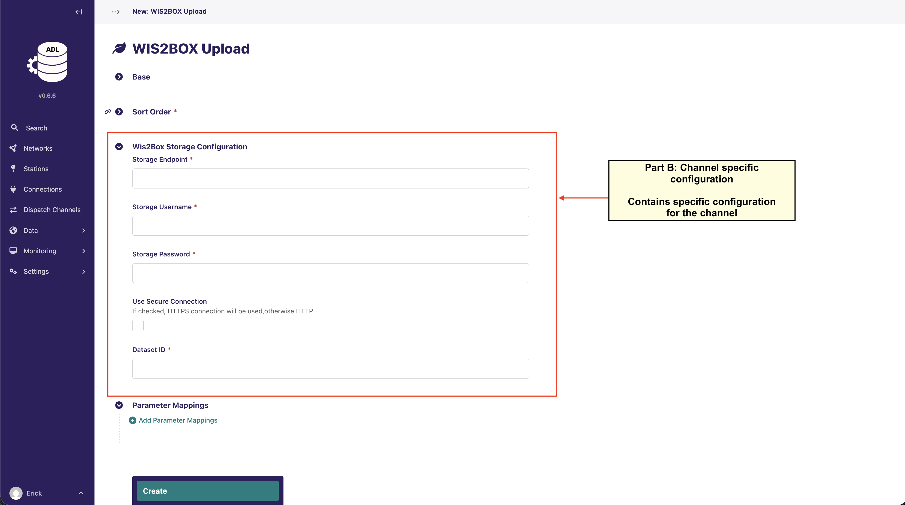
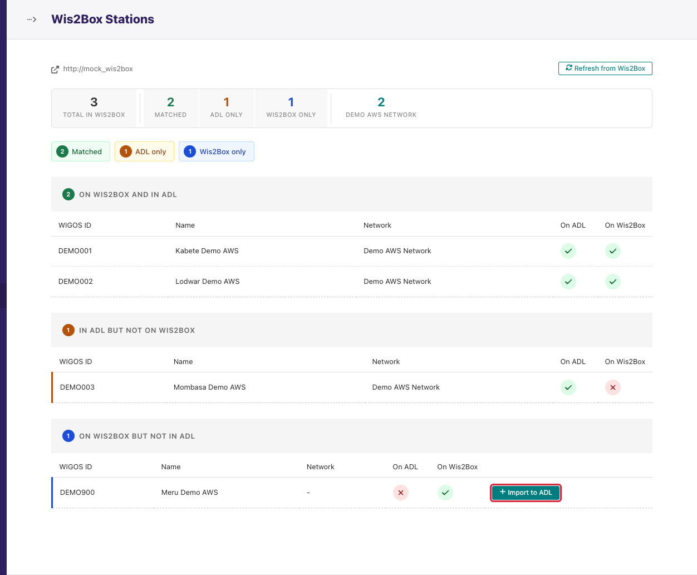

(wis2box-integration)=

# 📡 WIS2Box Integration

[wis2box](https://docs.wis2box.wis.wmo.int) is WMO's reference
implementation of a WIS2 node. ADL publishes observations to it by writing
CSV files into wis2box's MinIO storage, where wis2box's own pipeline turns
them into BUFR and publishes them. ADL and wis2box are separate systems,
usually on the same server; ADL talks to wis2box in two places, and this
page covers both.

```{mermaid}
flowchart LR
  subgraph ADL
    OBS[(Observation records)] --> DC[WIS2Box Upload\ndispatch channel]
    ST[Stations] <-. import / compare .-> WS[WIS2Box Stations page]
  end
  subgraph wis2box
    MINIO[(MinIO\nwis2box-incoming)] --> PIPE[csv2bufr → BUFR] --> PUB[WIS2 broker]
    OAPI[Station metadata\n/oapi/collections/stations]
  end
  DC -- "CSV per station\nper dispatch" --> MINIO
  WS -- "reads" --> OAPI
```

1. **Dispatching data** — a *WIS2Box Upload* dispatch channel uploads CSV
   files shaped for wis2box's AWS csv2bufr template into the
   `wis2box-incoming` bucket. This is the data path.
2. **Station metadata** — the *WIS2Box Stations* page under Settings reads
   the station list wis2box publishes and compares it with ADL's, so the
   two never disagree about which stations exist.

## Prerequisites

- A running wis2box with a **dataset** configured for surface observations
  using the AWS csv2bufr template, and the stations registered in wis2box's
  station metadata. See the wis2box documentation for both.
- The wis2box **MinIO storage endpoint** (host and port, typically `:9000`)
  reachable from the ADL host, and the MinIO **username and password**
  (`WIS2BOX_STORAGE_USERNAME` / `WIS2BOX_STORAGE_PASSWORD` in wis2box's
  `wis2box.env`).
- The wis2box **dataset id** (the `topic_hierarchy`/dataset identifier used
  as the folder path under `wis2box-incoming`).
- Optionally the wis2box **public URL** for the stations page.
- If wis2box is on a different host and you want TLS between them, see
  [WIS2BOX with SSL on the ADL server](wis2box-adl-nginx-proxy-manager.md).

## Dispatching data to wis2box

### 1. Units

wis2box's AWS template expects SI units: temperature in **Kelvin**,
pressure in **Pascal**, precipitation in **kg/m²**, wind speed in m/s,
direction in degrees. If you loaded the predefined parameters with
*conversion units* ticked, these units already exist; otherwise create them
under **Settings → Units** (`K`, `Pa`, `kg m-2`). ADL converts at dispatch
time from the parameter's unit, so stored data stays in °C, hPa and mm.

### 2. Create the channel

**Dispatch Channels → Add Dispatch Channel → WIS2BOX Upload**. The base
fields (name, connections, interval, timeout, batch size, aggregation) are
described in [Manage Dispatch Channels](user_guide/manage_dispatch_channels.md).
WIS2Box-specific fields:

| Field | Description |
|---|---|
| **Storage Endpoint** | MinIO host and port, without scheme: `wis2box-minio:9000` when both run on one Docker host and network, or `wis2box.example.org:9000`. |
| **Storage Username** / **Storage Password** | The MinIO credentials from `wis2box.env`. |
| **Use Secure Connection** | Tick when MinIO is served over HTTPS (behind a TLS proxy). Leave unticked for a plain `:9000` endpoint. |
| **Dataset ID** | The wis2box dataset identifier; files are uploaded to `wis2box-incoming/<dataset id>/`. |



### 3. Parameter mappings

Each row maps an ADL parameter to a **column of the AWS template** and the
unit that column expects. The column names come from the
[csv2bufr AWS template](https://training.wis2box.wis.wmo.int/csv2bufr-templates/aws-template/);
a worked mapping, the unit conversions ADL performs, and why rainfall must
use the *Sum* aggregation measure are in
{ref}`Manage Dispatch Channels <dispatch-parameter-mappings>`.

Station metadata columns (WIGOS identifier parts, coordinates, heights) are
filled from the ADL station automatically; you map only observed variables.

### 4. Aggregation

wis2box expects one row per hour per station. Tick **Send Aggregated Data**
with period *hourly*, and choose the measure per parameter: *average* for
temperature, humidity, pressure and wind speed; *sum* for precipitation.
Aggregated channels are by design about two hours behind real time, and the
dashboard's freshness thresholds allow for that.

### 5. Stations

The channel's **Station Links** page lists every station on the chosen
connections. Disable the ones that should not be published (non-GBON
stations, test stations). Every enabled station must exist in wis2box's
station metadata with the same WIGOS identifier, or wis2box rejects its
files — which is what the stations page below is for.

### 6. Test and run

On the channel's Station Links page press **Test connection**. It reports
one of:

| Message | Meaning | Fix |
|---|---|---|
| `Connected to <endpoint>; bucket 'wis2box-incoming' is accessible` | Endpoint, credentials and bucket all good. | — |
| `Connected to <endpoint>, but bucket 'wis2box-incoming' was not found` | MinIO answered with these credentials, but it is not a wis2box MinIO (or the bucket was removed). | Check the endpoint points at wis2box's storage. |
| `Connection failed: <error>` | Unreachable, refused, TLS mismatch, or wrong credentials (MinIO reports these as access-denied errors). | Check host, port, *Use Secure Connection* and the credentials. |

Then **Dispatch now**. Each station's activity log shows *Records Sent*;
on the wis2box side, `docker logs wis2box-management` shows the file being
picked up and converted. A file that wis2box rejects (unknown station,
malformed value) is logged there, not in ADL: ADL's job ends when the
upload succeeds.

## Keeping station lists aligned

**Settings → WIS2Box Stations** has two entries:

- **Settings** — one field, **Wis2Box URL**: the base URL of the wis2box web
  interface (for example `https://wis2box.example.org`). ADL reads
  `<url>/oapi/collections/stations/items` from it.
- **Stations** — the comparison page.


<!-- screenshot: manifest entry user/wis2box/stations_compare -->

The page fetches wis2box's station list (cached; **Refresh** re-fetches)
and joins it with ADL's stations on the WIGOS identifier, into three tables,
each with *WIGOS ID*, *Name*, *Network* and two indicator columns, *On ADL*
and *On Wis2Box*:

1. **On both** — stations that exist on both sides, grouped by ADL network.
   Nothing to do.
2. **Only in ADL** — stations ADL collects but wis2box does not know. Their
   data will be rejected by wis2box; register them in wis2box's station
   metadata, then refresh.
3. **Only in wis2box** — stations registered in wis2box that ADL has no
   record of. Each row has an **Import** action.

### Importing a station from wis2box

Import opens a form pre-filled from wis2box's metadata — WIGOS ID, name,
longitude, latitude, elevation, territory — with a *Status* column showing
whether it already exists. Choose the **Network** and the **Station type**
(automatic or manual), optionally the WMO block and station numbers, and
save. *Station imported successfully.* confirms; *Station `<WIGOS ID>` is
already in the database.* means someone imported it meanwhile.

Importing creates the ADL station only. To collect for it, add a station
link on the relevant connection; to publish it, make sure it is enabled on
the WIS2Box channel.

### Messages on this page

| Message | Meaning | What to do |
|---|---|---|
| `Please configure the wis2box URL in settings.` | The *Wis2Box URL* is empty. | Set it under Settings → WIS2Box Stations → Settings. |
| `Could not fetch stations from wis2box: <error>` | wis2box's API did not answer or returned an error; the page shows the last cached list, possibly empty. | Check the URL opens in a browser from the ADL host's network; check wis2box is up. |
| `Station not found in wis2box.` | The import link is stale; the station was removed from wis2box. | Refresh the comparison page. |

## Troubleshooting

**Test connection passes, dispatch shows records sent, nothing appears in
wis2box**
: The dataset id does not match a configured wis2box dataset, or the
  station is not in wis2box's metadata. Check `wis2box-management` logs for
  the rejection reason and the *Only in ADL* table above.

**Values in wis2box are wrong by a constant offset or factor**
: The *Channel Unit* on a parameter mapping is not the unit the template
  column expects (°C sent where K is required, mm where kg/m² is). Fix the
  mapping unit; ADL converts on the next dispatch.

**Rainfall totals are far too small or too large**
: The precipitation mapping uses *average* instead of *sum*. See the
  aggregation section of Manage Dispatch Channels.

**Channel shows OVERDUE**
: The dispatch worker or scheduler is down, not wis2box. Follow
  [Dispatch Troubleshooting](user_guide/dispatch_troubleshooting.md).
